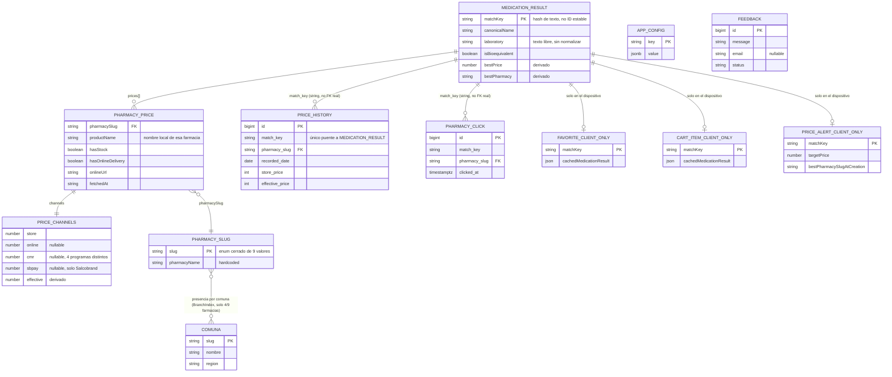

# Modelo de Dominio de ComparaFarma — Estado Actual

> **Propósito**: documentar el modelo de dominio *tal como existe hoy en el código* (entidades, atributos, relaciones, reglas de negocio) y usarlo como base para evaluar una evolución hacia un **Pharmaceutical Knowledge Graph**. Este documento **no propone cambios** — es un análisis del estado actual y un mapa de brechas/oportunidades para una discusión posterior.
>
> **Método**: lectura directa de `packages/domain/src/*`, `api/src/clients/*`, `api/src/lib/*Db.ts`, `docs/database/schema.sql`, stores de `mobile/src/store/*`, y la documentación existente (`docs/normalization.md`, `docs/price-channels.md`, `docs/farmacias.md`, `docs/pharmacy-flags.md`). Donde el código y la documentación existente discrepan, se señala explícitamente y se confía en el código.

---

## 1. Resumen ejecutivo

El dominio real de ComparaFarma hoy es **"comparación de precios de productos de farmacia identificados por texto libre"**, no un modelo clínico/farmacéutico estructurado. No existe un catálogo canónico de medicamentos: cada búsqueda genera resultados efímeros que se agrupan mediante una función de hashing de texto (`matchKey`) sobre el *nombre comercial* tal como lo entrega cada farmacia. No hay entidades para principio activo, forma farmacéutica, código ATC, registro ISP, indicaciones o interacciones — aunque parte de esa información **sí existe en las fuentes** (algunas APIs de farmacia la exponen) y se descarta al mapear al modelo común.

La persistencia real (Supabase) es reciente y deliberadamente acotada a 4 tablas operativas (config, feedback, historial de precios agregado, clicks) — no hay una tabla de "medicamentos". Todo lo demás vive en memoria de request o en `AsyncStorage` del dispositivo (mobile).

---

## 2. Entidades y value objects — estado actual

### 2.1 `MedicationResult` (entidad raíz de una búsqueda)
`packages/domain/src/types.ts:32`

| Atributo | Tipo | Notas |
|---|---|---|
| `matchKey` | `string` | **Identidad de facto** del "medicamento" agrupado. No es un ID estable — se recalcula en cada búsqueda a partir del nombre comercial (ver §4.2). No hay migración de identidad: si el algoritmo cambia, las claves de todo el historial cambian con él (de ahí el versionado `search_cache_v10_`). |
| `canonicalName` | `string` | Elegido heurísticamente entre los nombres de las farmacias que matchean (ver regla en §4.3) — no es un nombre normalizado por catálogo, es literalmente el string de una de las farmacias. |
| `laboratory` | `string \| null` | Texto libre por farmacia (`hit.brand`, `product.manufacturer_name`, vendor de Shopify, etc.) — **sin normalizar**: el mismo laboratorio puede aparecer con grafías distintas entre farmacias y no hay entidad `Laboratorio`. |
| `isBioequivalent` | `boolean` | Colapsa una certificación regulatoria (ISP, Chile) a un booleano. Sin fecha de certificación, sin ID de registro, sin trazabilidad. Además es heterogéneo en calidad (ver §5). |
| `prices` | `PharmacyPrice[]` | 1..N ofertas — ver 2.2. Ordenado por `channels.effective` ascendente tras `mergeDuplicates`. |
| `bestPrice` / `bestPharmacy` | `number` / `string` | Derivados de `prices` (redundancia calculada, no fuente de verdad). |
| `imageUrl` | `string \| null` | Primera imagen no-nula entre los miembros fusionados. |

Esta es una entidad **transitoria**: no se persiste como tal en ninguna base de datos. Sólo sus atributos derivados (`match_key`, `canonical_name`, precios) se proyectan parcialmente en `price_history` (ver 2.6).

### 2.2 `PharmacyPrice` (oferta de una farmacia para un `MedicationResult`)
`packages/domain/src/types.ts:20`

| Atributo | Tipo | Notas |
|---|---|---|
| `pharmacySlug` | `PharmacySlug` (enum cerrado de 9 valores) | Identidad de la farmacia — ver 2.4. |
| `pharmacyName` | `string` | Nombre para mostrar (redundante con `pharmacySlug`, hardcoded en `api/src/lib/pharmacies.ts`). |
| `productName` | `string` | Nombre del producto **tal como lo entrega esa farmacia específica** — puede diferir de `canonicalName`. |
| `channels` | `PriceChannels` | Value object, ver 2.3. |
| `hasStock` | `boolean` | Semántica inconsistente entre farmacias (ver §5 — Ahumada siempre `true`). |
| `hasOnlineDelivery` | `boolean` | En varios clientes está hardcodeado (`true`) en vez de derivarse de un dato real. |
| `onlineUrl` | `string \| null` | URL directa al producto en el sitio de la farmacia. |
| `imageUrl` | `string \| null` | — |
| `fetchedAt` | `string` (ISO) | Timestamp de scraping — **no se usa** actualmente para elegir qué precio prevalece al fusionar (ver hallazgo en §4.3). |

### 2.3 `PriceChannels` (value object, no entidad)
`packages/domain/src/types.ts:12`

| Canal | Tipo | Semántica |
|---|---|---|
| `store` | `number` (siempre presente) | Precio presencial / de vitrina. |
| `online` | `number \| null` | Precio exclusivo compra web (delivery o click&collect). |
| `cmr` | `number \| null` | Precio con tarjeta de fidelización — el nombre del campo es histórico ("CMR Falabella") pero en la práctica representa **cualquier** tarjeta de fidelización según la farmacia: T. Más (Salcobrand), CMR (Ahumada), Fonasa (Farmex), Plus (EasyFarma). **Un mismo campo modela 4 programas de fidelización distintos sin diferenciarlos** — ver §5. |
| `sbpay` | `number \| null` | Medio de pago específico de Salcobrand. |
| `effective` | `number` (derivado) | `min(store, online ?? store, cmr ?? store, sbpay ?? store)` — calculado, no capturado. |

### 2.4 `PharmacySlug` (enum cerrado, no entidad)
`packages/domain/src/types.ts:1`

9 valores fijos en código: `cruz-verde`, `salcobrand`, `ahumada`, `dr-simi`, `araucomed`, `ecofarmacias`, `farmex`, `sermecoop`, `easyfarma`. No es una tabla ni catálogo — agregar una farmacia requiere tocar el enum, el mapa de nombres (`api/src/lib/pharmacies.ts`), el mapa de dominios permitidos (`api/src/lib/clickTracking.ts`), y escribir un cliente nuevo. No hay entidad "Farmacia" con atributos propios (razón social, RUT, sitio web, etc.) más allá de estos mapas dispersos.

### 2.5 `Comuna` / cobertura de sucursales (entidad débil, solo lectura)
`api/src/clients/minsal.ts`, `api/src/data/branches-data.ts`, endpoint `GET /api/branches`

La fuente (MINSAL, dataset público de farmacias de turno) trae por sucursal: `local_id`, `local_nombre`, dirección, teléfono, **lat/lng**, día de funcionamiento, comuna, región. El modelo final (`BranchIndex`) **descarta casi todo eso** y lo colapsa a:

```
byCommune: { [comuna]: PharmacySlug[] }     // "esta cadena tiene alguna sucursal en esta comuna"
communes:  { [comuna]: { nombre, region } }
```

No hay entidad `Sucursal` (con dirección, geolocalización, horario) ni relación entre una oferta de precio (`PharmacyPrice`) y una sucursal concreta — el dato es a nivel de cadena×comuna, generado por un script manual (`scripts-temp/fetch-branches.js`, cobertura parcial: "1/7 días acumulados" según el comentario en el archivo generado) y no se recalcula automáticamente. Solo cubre 4 de las 9 farmacias (las que están en el dataset MINSAL: Cruz Verde, Salcobrand, Ahumada, Dr. Simi).

### 2.6 Entidades persistidas en Supabase/Postgres
`docs/database/schema.sql`

| Tabla | Clave | Atributos | Rol en el dominio |
|---|---|---|---|
| `app_config` | `key` (PK, texto) | `value` (jsonb), `updated_at` | Configuración genérica clave/valor — hoy solo dos claves conocidas en uso: farmacias deshabilitadas y config del banner de donación. No es una entidad de dominio farmacéutico, es infraestructura de feature flags. |
| `feedback` | `id` (identity) | `message`, `email` (nullable), `status` (default `open`), `created_at` | Sin relación con `MedicationResult` ni con ninguna otra entidad — feedback libre de usuario. |
| `price_history` | `id` (identity), `unique(match_key, pharmacy_slug, recorded_date)` | `canonical_name`, `store_price`, `effective_price`, `channels` (jsonb), `recorded_date`, `created_at` | La única tabla que referencia `match_key` — es decir, la única persistencia real de la "identidad" de un medicamento, y esa identidad es el string opaco de `matchKey`. |
| `pharmacy_clicks` | `id` (identity) | `match_key`, `pharmacy_slug`, `clicked_at` | Evento de clic saliente (medición de tráfico), también atado a `match_key` como único puente hacia "qué medicamento". |

**Hallazgo relevante**: `price_history` hace `upsert` con `onConflict: match_key,pharmacy_slug,recorded_date` (`api/src/lib/priceHistoryDb.ts:44`). Esto significa que la fila de un día **se sobrescribe** con el último cache-miss de ese día — no es un promedio, ni el primer precio del día, ni un cierre real: es un artefacto de **cuándo un usuario disparó una búsqueda que no estaba en caché**. Como serie de tiempo de precios, tiene sesgo de muestreo (depende del tráfico de búsquedas, no de un scraping periódico programado).

Ninguna de las 4 tablas tiene RLS permisiva — el acceso es solo server-side con la *secret key* (bypassea RLS), la RLS habilitada es defensa en profundidad, no control de acceso activo.

### 2.7 Entidades solo-cliente (mobile, `AsyncStorage`, sin contraparte server)

| Store | Entidad | Atributos clave | Notas de modelado |
|---|---|---|---|
| `favoritesStore` | Favorito | `matchKey` + `MedicationResult` completo cacheado | Guarda el snapshot completo de precios en el momento de marcar como favorito — no se re-sincroniza automáticamente. |
| `cartStore` | ItemCarrito | `MedicationResult` completo, máx. 8 | Mismo problema: snapshot congelado, no una referencia viva. |
| `alertsStore` | `PriceAlert` | `matchKey`, `canonicalName`, `targetPrice`, `bestPharmacy` (slug al momento de crear la alerta), `createdAt`, `triggeredAt` | La granularidad es *medicamento* (`matchKey`), no *medicamento+farmacia* — una alerta no puede decir "avísame si baja en Salcobrand específicamente". |
| `historyStore` | Búsqueda reciente | query de texto, últimas 10 | Sin relación con `matchKey` — es el texto crudo tecleado, no el resultado. |
| `toastStore` | Notificación efímera | cola en memoria | No persistente, no es dominio de negocio. |

**Todas estas entidades viven exclusivamente en el dispositivo.** No hay sincronización entre dispositivos, no hay cuenta de usuario, y ninguna de ellas tiene contraparte en Supabase — son completamente invisibles para `api/` o `web/`.

---

## 3. Diagrama entidad-relación — estado actual



**Nota de lectura**: las relaciones hacia `PRICE_HISTORY` y `PHARMACY_CLICK` están marcadas como "no FK real" porque `match_key` es un `text` sin restricción de integridad referencial hacia ningún catálogo — es un string que dos sistemas distintos (el motor de búsqueda en caliente y las tablas de Supabase) *asumen* que significa lo mismo, pero nada en el esquema lo garantiza. Si el algoritmo `matchKey` cambia, las filas históricas quedan huérfanas silenciosamente.

---

## 4. Reglas de negocio identificadas en el código

### 4.1 Limpieza de query (`cleanQuery`) — `packages/domain/src/normalization.ts`
Elimina formas farmacéuticas, rutas de administración, unidades/dosis, instrucciones de receta ("tomar 1 cada 8h"), y texto entre paréntesis/corchetes, antes de enviar la query a las 9 farmacias.

### 4.2 Generación de identidad (`matchKey`) — `packages/domain/src/matching.ts`
Esta es la regla de negocio más crítica del sistema — define qué se considera "el mismo medicamento":
1. Normaliza acentos y minúsculas.
2. Extrae dosis (ml > mcg > mg > g, en ese orden de precedencia si hay varias unidades presentes) y convierte gramos a mg.
3. Concatena guiones entre letras ("Co-Amoxiclav" → "coamoxiclav").
4. Toma la primera palabra "marca" (no stop-word, no numérica) como `first`; si es ≤4 letras y la siguiente también, las fusiona ("Trio Val" → "trioval") — heurística para nombres compuestos cortos.
5. Detecta indicador de turno día/noche (`\bdia\b` / `\bnoche\b`) como campo **separado** — un antigripal "Día" y su versión "Noche" son productos distintos (composición distinta), no deben fusionarse aunque compartan marca y dosis.
6. Detecta cantidad de unidades (x20, "20 comprimidos", etc.); **normaliza qty=1 a vacío** porque las farmacias son inconsistentes en si escriben "1 sobre" explícitamente o lo omiten — sin esto, el mismo producto genera claves distintas entre Cruz Verde y Salcobrand (documentado con ejemplos reales en `docs/normalization.md`).
7. Retorna `"{marca}|{dosis}|{turno}|{cantidad}"`, omitiendo segmentos vacíos.

**Regla implícita de diseño**: la forma farmacéutica (comprimido vs. efervescente vs. jarabe) se ignora deliberadamente para maximizar coincidencias entre farmacias — trade-off documentado en `docs/normalization.md` como límite conocido (puede fusionar incorrectamente formas distintas de una misma dosis).

### 4.3 Fusión de duplicados (`mergeDuplicates`) — `packages/domain/src/deduplication.ts`
- Agrupa por `matchKey`.
- **Nombre canónico**: prefiere el miembro del grupo con `laboratory` no-nulo; si hay empate, el de nombre más corto.
- **Fusión de precios por farmacia**: si dos miembros del grupo tienen precio de la misma farmacia, se queda con el de **menor `channels.effective`** (`deduplication.ts:24`).
  - ⚠️ **Discrepancia entre código y documentación**: `docs/normalization.md` (línea 115) describe esta regla como "manteniendo el más reciente por farmacia (`fetchedAt`)". El código no mira `fetchedAt` en absoluto — compara `effective` y se queda con el menor. En la práctica normalmente no importa (dentro de una misma ejecución de búsqueda todos los `fetchedAt` son casi simultáneos), pero es una afirmación incorrecta en la documentación que vale la pena corregir por separado, y señala que la regla real es "precio más barato gana", no "dato más fresco gana" — con implicancias si en el futuro se cachean resultados de distintas farmacias en momentos distintos.
- Imagen: primera no-nula entre los miembros.

### 4.4 Precio efectivo (`effectivePrice`) — `packages/domain/src/pricing.ts`
`effective = min(store, online ?? store, cmr ?? store, sbpay ?? store)` — el "mejor precio real disponible" sin considerar restricciones de acceso (el usuario puede no tener la tarjeta de fidelización requerida para el canal `cmr` o `sbpay`). La UI muestra los 4 canales igual, no oculta los que no aplican al usuario.

### 4.5 Feature flags de farmacia (`api/src/lib/pharmacyFlags.ts`, `appConfigDb.ts`)
- Fuente de verdad: `app_config` (Supabase, clave `disabled_pharmacies`), editable desde `/admin` sin redeploy, cacheada 60s en memoria de proceso.
- Fallback: variable de entorno `DISABLED_PHARMACIES` en Vercel, si Supabase no responde.
- Efecto: una farmacia deshabilitada no se consulta en `searchService.ts`, no aparece en `/api/config`, y la app oculta su chip de filtro y bloque de precios.

### 4.6 Anti open-redirect en `/api/go` (`api/src/lib/clickTracking.ts`)
Antes de redirigir (302) hacia la URL de una farmacia, valida que el hostname coincida exactamente o sea subdominio del dominio real de esa farmacia (`ALLOWED_DOMAINS`, hardcoded por slug) y que el protocolo sea `https:`. Si no matchea, responde 400. Esta es la única regla de negocio de seguridad explícita ligada a una entidad del dominio (la farmacia).

### 4.7 Autorización de `/admin` (web)
Dos condiciones combinadas, no una tabla de roles: sesión válida de Supabase Auth (Google OAuth) **y** email presente en `ADMIN_ALLOWED_EMAILS` (whitelist en env var, no en base de datos). Supabase auto-provisiona la cuenta en el primer login OAuth — la whitelist es la única barrera real.

### 4.8 Degradación ante ausencia de configuración
Regla transversal en todos los módulos `*Db.ts`: si `SUPABASE_URL`/`SUPABASE_SECRET_KEY` no están definidas, cada función retorna `null` o no hace nada (no lanza error). Diseño deliberado para que un problema de Supabase no tumbe `/api/search`, pero implica que un fallo de persistencia (feedback no guardado, historial no registrado) es silencioso.

---

## 5. Brechas: datos disponibles en las fuentes pero no modelados

Comparando `docs/farmacias.md` (qué expone cada API cruda) contra `ScrapedProduct`/`PharmacyPrice`/`MedicationResult` (qué efectivamente se captura), hay información que **existe en el origen y se descarta al mapear**:

| Dato disponible en la fuente | Farmacia(s) donde se confirmó | Se captura hoy? |
|---|---|---|
| SKU / código EAN-13 | EcoFarmacias (`product.sku`), Farmex (`variants[0].sku`) | ❌ No existe campo en `ScrapedProduct` |
| Indicaciones médicas | Farmex (`product.indicaciones`) | ❌ Descartado |
| Contraindicaciones | Farmex (`product.contraindicaciones`) | ❌ Descartado |
| Posología | Farmex (`product.posologia`) | ❌ Descartado |
| Requiere receta | EcoFarmacias (categoría "Receta Simple") | ❌ Descartado |
| Precio Fonasa / seguro específico | Farmex (múltiples variantes por convenio: Fonasa, Metlife, Yapp) | ⚠️ Parcial — se mapea a `channels.cmr` sin distinguir de qué convenio viene |
| Precio por unidad (fraccionado) | Farmex (`precio_fraccionado`) | ❌ Descartado |
| Categoría Cenabast | EcoFarmacias | ❌ Descartado |
| Geolocalización de sucursal (lat/lng, dirección, horario) | Dataset MINSAL (usado para `branches-data.ts`) | ❌ Colapsado a presencia por comuna, sin coordenadas ni sucursal individual |
| Registro ISP / código regulatorio | Liga Farmacia (código en URL de producto, "podría ser código ISP" según nota en `docs/farmacias.md`) | ❌ No integrado (farmacia en investigación) |

**Nota**: `docs/farmacias.md` describe a EcoFarmacias y Farmex como "🕐 Backlog" — pero ambos están **integrados y activos** en `api/src/clients/` hoy. El documento está desactualizado respecto al código; se señala aquí porque afecta la lectura de qué campos realmente se están perdiendo (los "Campos disponibles en la API" listados para esas dos farmacias en ese documento son reales y siguen sin capturarse en el cliente implementado).

### Otras inconsistencias de calidad de dato observadas en el código de los clientes

- **`hasStock` no es comparable entre farmacias**: Ahumada lo hardcodea en `true` siempre (`api/src/clients/ahumada.ts`, comentario explícito "no disponible en HTML"); Dr. Simi y Cruz Verde sí derivan un booleano real de la API. El campo tiene el mismo nombre y tipo en todas partes, pero **no la misma confiabilidad**.
- **`hasOnlineDelivery` hardcodeado** en varios clientes (ej. Farmex siempre `true`, Dr. Simi siempre `true`) en vez de derivarse de un dato real de la fuente.
- **`isBioequivalent` con métodos de detección heterogéneos**: campo estructurado en Salcobrand/Dr. Simi/Cruz Verde, badge de imagen HTML en Ahumada, regex de texto libre sobre nombre+descripción en AraucoMed (`/bioequivalen/i` — puede dar falsos negativos), y **siempre `false`** (no implementado) en Farmex. Es el mismo campo booleano en el tipo compartido, pero la certeza detrás varía de "dato oficial" a "adivinado por texto" a "no medido".
- **`laboratory` es texto libre sin diccionario de normalización**: no hay paso de limpieza equivalente a `cleanQuery` para nombres de laboratorio — dos farmacias pueden reportar el mismo laboratorio con mayúsculas, abreviaturas o razón social distintas y `mergeDuplicates` no los concilia (solo elige "el primero no-nulo").

---

## 6. Oportunidades de evolución hacia un Pharmaceutical Knowledge Graph

Esta sección es exploratoria — nombra conceptos y brechas, **no propone una implementación ni un plan de migración**.

### 6.1 El problema de fondo
El modelo actual no tiene un concepto de **medicamento como entidad canónica independiente de la oferta comercial**. Todo pivotea sobre `matchKey`, que es:
- Derivado 100% del texto que cada farmacia decide poner en el nombre del producto (sin estandarización de la industria detrás).
- Recalculado en cada búsqueda — no hay un catálogo persistente que se pueda enriquecer, versionar o auditar.
- Frágil ante cambios de redacción de una farmacia (un cambio de "500 mg" a "0.5 g" en el nombre ya está cubierto por la conversión de unidades, pero un cambio de orden de palabras o de abreviatura no probada en los tests podría no fusionar correctamente).

Un Knowledge Graph farmacéutico típicamente separaría lo que hoy es una sola clave de texto en varias capas de entidades independientes y sus relaciones:

| Concepto (target) | Qué sería | Se relaciona hoy con... |
|---|---|---|
| **Principio activo** | Ingrediente farmacológico normalizado (ej. "paracetamol"), potencialmente con código ATC | Hoy: substring detectado heurísticamente dentro de `first` en `matchKey` — sin entidad propia, sin soporte para combinaciones de 2+ principios activos (ej. "Paracetamol + Cafeína") como conjunto estructurado. |
| **Forma farmacéutica** | Comprimido, jarabe, crema, etc. como atributo estructurado | Hoy: es una stop-word que se *elimina* de `matchKey` para maximizar matches — es decir, el diseño actual va en la dirección opuesta a modelarla. |
| **Presentación / envase** | Cantidad de unidades, volumen, concentración por unidad | Hoy: parcialmente capturado como `dosis` + `cantidad` dentro del string `matchKey`, sin estructura tipada (son substrings, no campos). |
| **Producto comercial** | La combinación marca+laboratorio+presentación tal como la vende un fabricante, independiente de qué farmacia la ofrezca | Hoy: no existe — lo más cercano es `canonicalName`, que es un string elegido heurísticamente entre los nombres que trajeron las farmacias, no un identificador de catálogo. |
| **Registro sanitario (ISP)** | Certificación regulatoria oficial (incluye bioequivalencia con fecha/vigencia) | Hoy: `isBioequivalent: boolean` sin fecha, sin ID de registro, con métodos de detección heterogéneos (ver §5). |
| **Laboratorio / fabricante** | Entidad normalizada (razón social, país) | Hoy: string libre por farmacia, sin diccionario de normalización. |
| **Farmacia** | Entidad con atributos propios (razón social, canales soportados, dominios permitidos) | Hoy: enum + mapas dispersos en 3 archivos distintos (`pharmacies.ts`, `pharmacyFlags.ts`, `clickTracking.ts`). |
| **Sucursal** | Punto de venta físico geolocalizado | Hoy: colapsado a "presencia por comuna" para 4/9 farmacias, sin coordenadas ni horario. |
| **Indicaciones / contraindicaciones / posología** | Información clínica estructurada | Hoy: existe en al menos una fuente (Farmex) y se descarta por completo. |
| **Interacciones medicamentosas** | Relación N:N entre principios activos | Hoy: no existe en ninguna fuente integrada ni en el modelo. |

### 6.2 Por qué hoy sería difícil construir el grafo sin trabajo previo
- **No hay identidad estable**: para anclar un grafo se necesita un ID de producto/principio activo que no cambie entre versiones del algoritmo de matching. Hoy ese rol lo cumple `matchKey`, que está explícitamente documentado como algo que cambia de versión en versión (`v1`...`v10` en `docs/normalization.md`).
- **La normalización actual optimiza para lo contrario de un grafo rico**: `cleanQuery`/`matchKey` *eliminan* información (forma farmacéutica, texto entre paréntesis) para maximizar la tasa de fusión entre farmacias. Un Knowledge Graph necesitaría conservar esa información en campos estructurados en vez de descartarla, sin perder la capacidad de fusión (son objetivos en tensión).
- **Cobertura de datos ricos es dispareja entre farmacias**: solo Farmex expone indicaciones/contraindicaciones/posología entre las 9 integradas; construir un grafo confiable de conocimiento clínico con una sola fuente parcial es limitado — probablemente se necesitaría una fuente autoritativa externa (ej. registro ISP público, Vademécum) en vez de (o adicional a) los scrapers de e-commerce actuales, cuyo propósito original es precio, no información clínica.
- **No hay separación entre "catálogo" y "oferta"**: un grafo de conocimiento normalmente separa el nodo "medicamento" (estable) de los nodos "oferta de precio por farmacia" (volátiles, se recalculan en cada búsqueda). Hoy ambos están fusionados en un solo objeto (`MedicationResult`) que se reconstruye desde cero en cada request.

### 6.3 Preguntas abiertas para la siguiente conversación (no respondidas en este documento)
- ¿El Knowledge Graph reemplazaría `matchKey` como mecanismo de fusión, o viviría como una capa adicional de enriquecimiento sobre los resultados ya fusionados?
- ¿Qué fuente sería autoritativa para principio activo/ATC/registro ISP — un dataset público chileno, o construcción incremental a partir de lo que ya traen las 9 farmacias?
- ¿Vale la pena capturar los campos que hoy se descartan (indicaciones, SKU, posología) aunque solo una farmacia los tenga, como primer paso incremental?
- ¿El grafo se persistiría en Supabase (ya presente en la arquitectura) o requeriría una tecnología de grafo dedicada?

---

## 7. Resumen de hallazgos para seguimiento

1. `docs/normalization.md` describe incorrectamente la regla de fusión de precios en `mergeDuplicates` (dice "más reciente por `fetchedAt`", el código usa "menor `effective`") — corregir la documentación por separado.
2. `docs/farmacias.md` describe a EcoFarmacias y Farmex como "Backlog" cuando ya están integrados en producción — desactualizado.
3. Existen campos clínicamente valiosos (indicaciones, contraindicaciones, posología, SKU/EAN, receta requerida) disponibles en al menos una fuente integrada (Farmex, EcoFarmacias) que se descartan silenciosamente al mapear a `ScrapedProduct`.
4. `hasStock` y `hasOnlineDelivery` tienen el mismo tipo (`boolean`) en las 9 farmacias pero confiabilidad muy distinta (algunos hardcodeados, no derivados de dato real) — un consumidor del dato no puede distinguir "sin stock confirmado" de "dato no disponible, asumido true".
5. La cobertura de sucursales (`BranchIndex`) cubre solo 4/9 farmacias, con datos generados manualmente y parcialmente (comentario "1/7 días acumulados" en el archivo autogenerado) — no se sabe si sigue vigente sin volver a correr el script.
6. `price_history` es una serie de tiempo sesgada por tráfico de búsquedas (upsert por día, no un scraping programado) — vale la pena tenerlo presente antes de usar esos datos para análisis de tendencias de precio.
