# BRAND_EXPERIENCE_V1 — Materialización de la Identidad de LET (BRAND-001 + UX-001 + BRAND-003)

**Naturaleza de este documento:** materialización, no teoría. Presenta **una única dirección** — la aprobada — aplicada a la primera experiencia visual completa de ComparaFarma, producto de LET. No investiga, no compara alternativas, no crea principios nuevos. No modifica ningún archivo existente de Brand, Design o Design System. No se generó código, CSS, Tailwind ni React — los mockups son SVG generado programáticamente (Python + CairoSVG para el render a PNG).

**Actualización UX-001 (evolución, no reemplazo):** la Home Desktop y la Home Mobile fueron evolucionadas sobre esta misma base para mejorar conversión, sin tocar color, tipografía, iconografía, componentes ni Design System — ver §1.1 para el detalle de qué cambió y por qué. El resto del documento (secciones 1, 2, 3.3–3.10, 4, 5) permanece sin cambios respecto a la versión BRAND-001.

**Actualización BRAND-003 (materialización de BRAND-002):** los seis conceptos propuestos en `DISTINCTIVE_PRODUCT_IDENTITY.md` — más el Empty State — ya existen como componentes visuales completos en `docs/design/product/SIGNATURE_COMPONENTS.md`, con tamaño, grosor, radios, variantes y estados definidos. El bloque "Ejemplo real" de la Home Desktop (§3.1) ya incorpora el primero de ellos, el Savings Arc, junto al monto de ahorro — ver §6.

**Decisiones ya aprobadas y respetadas aquí, sin reabrir:**
- Dirección visual **Intelligence** — 70% Data Intelligence / 20% Minimal Tech / 10% Human + Technology.
- Arquitectura cromática: **Brand / Accent / Feedback / Neutral.**
- Iconografía: **Lucide** (línea simple, esquinas redondeadas, grosor de trazo constante, grilla de 24px).
- Isotipo: **Candidato 09** (`docs/design/assets/candidato_09_plano_construccion.svg`), aplicado sin rediseñar — mismo trazo, mismo punto central, estado "Aprobar con ajustes" según `docs/design/brand/LOGO_SYSTEM.md`.

Todos los assets están en `docs/design/assets/brand-experience/` (SVG + PNG, 13 pares).

---

## 1. Sistema de color aplicado

Arquitectura Brand / Accent / Feedback / Neutral, partiendo de la Opción A de `docs/archive/design/research/COLOR_RESEARCH.md` como fuente trazable. Se ejerció el permiso explícito de este sprint: **refinar, no rediseñar**. El ajuste fue exclusivamente de luminosidad HSL (hue y saturación intactos), aplicado donde el HEX de origen no alcanzaba 4.5:1 de contraste contra blanco — el mínimo WCAG AA para texto normal.

| Rol | Color | HEX | Origen / ajuste | Contraste vs. blanco |
|---|---|---|---|---|
| Brand (primary) | Indigo | `#3F3FB8` | Sin cambio | 8.03:1 |
| Brand (ink, hover/texto sobre claro) | Indigo oscuro | `#2E2E8C` | Derivado del Brand | — |
| Accent | Teal profundo | `#0D827B` | `#0E8E86` → `#0D827B` | 4.65:1 |
| Feedback / Success | Verde | `#2B8354` | `#2F8F5B` → `#2B8354` | 4.66:1 |
| Feedback / Warning | Ámbar oscuro | `#9F6B0C` | `#B4790E` → `#9F6B0C` | 4.60:1 |
| Feedback / Error | Rojo | `#B23B33` | Sin cambio | 5.89:1 |
| Feedback / Information | Azul cielo oscuro | `#1C7BAE` | `#1C7DB0` → `#1C7BAE` | 4.65:1 |
| Neutral N50 | `#F5F6F7` | Fondo de superficie | — |
| Neutral N100 | `#E7E9EB` | Superficie secundaria | — |
| Neutral N200 | `#D5D8DC` | Borde sutil | — |
| Neutral N300 | `#C2C7CC` | Borde de card/input | — |
| Neutral N500 | `#7C848C` | Texto secundario | — |
| Neutral N700 | `#454B52` | Texto de soporte | — |
| Neutral N900 | `#1B1F23` | Texto primario | — |

Cada valor de Feedback quedó al menos un escalón de luminosidad por debajo del origen — el cambio es deliberadamente pequeño (2-6 puntos de lightness), preservando la intención cromática de `COLOR_RESEARCH.md` Opción A. Ningún hue ni saturación fue alterado; ninguna filosofía cambió.

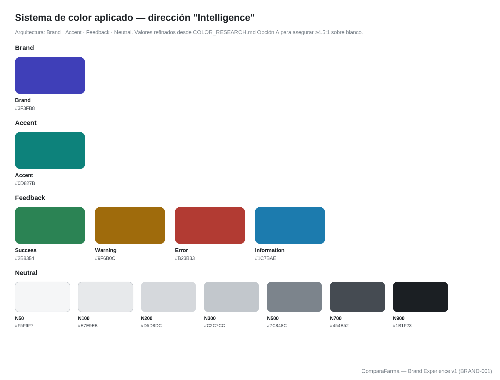

---

## 2. Sistema tipográfico aplicado

**Familia única: Inter.** Elegida (no investigada de nuevo — la investigación ya cerró en `VISUAL_BENCHMARK.md`/`VISUAL_EXPLORATION.md`), aplicada en 5 capas siguiendo la estructura de `docs/design/brand/TYPOGRAPHY_SYSTEM.md` §4.2:

| Capa | Tamaño | Peso | Uso |
|---|---|---|---|
| Display | 40px | 700 | Titulares de Home/Landing |
| Heading | 26px | 700 | Encabezados de sección |
| Body | 15px | 400 | Texto de interfaz, descripciones |
| Caption | 12px | 400 | Metadatos, etiquetas, badges |
| Data / Numeric | 22px | 700 | Precios y cifras — con alineación tabular |

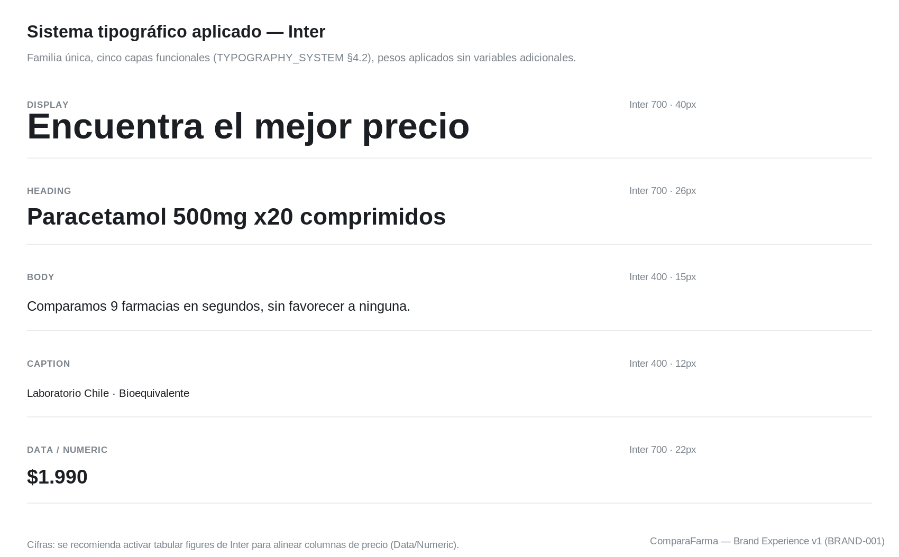

---

## 3. Experiencia aplicada — pantallas

### Landing / Home Desktop

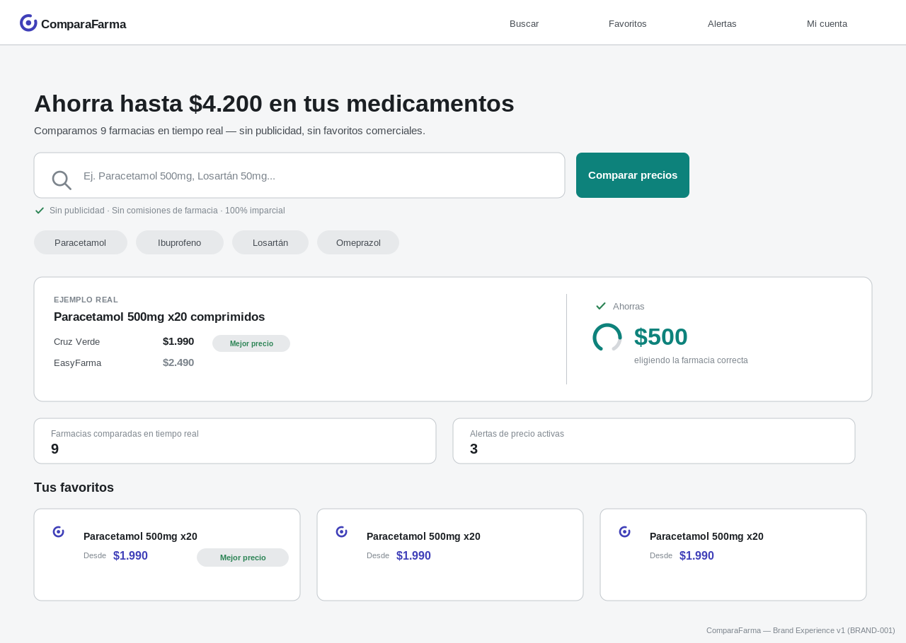

### Landing / Home Mobile

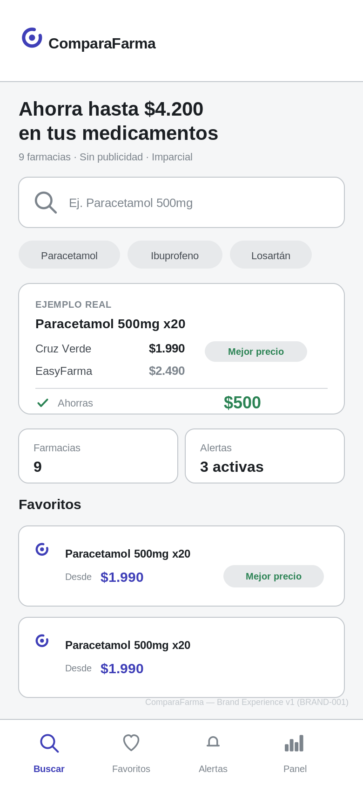

### 3.1 UX-001 — Por qué cambió la Home (rationale, no rediseño)

El comité observó, sobre la Home original de BRAND-001, que la interfaz era limpia y consistente pero no transmitía todavía una propuesta de valor poderosa — parecía "una aplicación moderna", no "la mejor forma de comprar medicamentos". El objetivo de este ajuste no fue mejorar el diseño (color, tipografía e iconografía no se tocaron) sino la conversión: que una persona quiera buscar en menos de cinco segundos. Qué cambió y por qué:

| Elemento | Antes (BRAND-001) | Ahora (UX-001) | Por qué |
|---|---|---|---|
| Hero | "Encuentra el mejor precio" — describe una función | "Ahorra hasta $4.200 en tus medicamentos" — hace una promesa con un número real | Una función se explica; una promesa con una cifra concreta se siente. El número usado es el mismo dato que ya mostraba la tarjeta "Ahorro promedio" — no se inventó ninguna cifra nueva. |
| Buscador | Ancho 700px, botón "Buscar", placeholder genérico | Ancho 750px, botón "Comparar precios", placeholder con dos ejemplos reales de medicamento | El buscador sigue siendo el primer elemento interactivo de la pantalla, ahora más ancho que cualquier otro bloque y con una etiqueta de acción que nombra el resultado (comparar precios), no el mecanismo (buscar). |
| Confianza | Solo en el subtítulo ("sin favorecer a ninguna") | Microcopy propio con ícono de check, inmediatamente bajo el buscador: "Sin publicidad · Sin comisiones de farmacia · 100% imparcial" | La imparcialidad pasa de ser una frase dentro de otra oración a ser una afirmación visible en el momento exacto en que la persona va a confiar sus datos de búsqueda a la plataforma. |
| Prueba de valor | Tres tarjetas de métrica con el mismo peso visual (Ahorro promedio, Farmacias activas, Alertas activas) | Un bloque "Ejemplo real" en la posición de mayor jerarquía después del buscador: Paracetamol 500mg x20 comparado entre Cruz Verde ($1.990, Mejor precio) y EasyFarma ($2.490), con el resultado "Ahorras $500" destacado | Una cifra abstracta ("$4.200 de ahorro promedio") no es una prueba — es una afirmación. Un ejemplo con dos farmacias y dos precios reales es una prueba verificable, y usa exactamente el mismo patrón de comparación (`PriceChannels`) que ya gobierna toda la plataforma. |
| Jerarquía de cards | Ahorro promedio, Farmacias activas y Alertas activas competían por la misma atención | El ejemplo real ahora es el bloque protagonista; "Farmacias comparadas en tiempo real" y "Alertas de precio activas" pasan a un segundo nivel, más pequeñas y sin color de acento | La secuencia de lectura ahora es: promesa → buscador → confianza → prueba → contexto → favoritos. Antes, las tres tarjetas de métrica no tenían una secuencia — competían entre sí por el mismo nivel de atención. |
| Favoritos | Tercer bloque de la pantalla | Se mantiene como el bloque de menor prioridad, sin cambios en su tratamiento visual | Es información de retorno (para quien ya usa la plataforma), no de conversión inicial — no compite con el resto del rediseño. |
| Identidad sin logo | El único elemento distintivo era el color de marca en el botón y en los precios | La combinación buscador‑protagonista + bloque "Ejemplo real" con dos farmacias y un resultado de ahorro es una composición que hoy no existe en el benchmark ya aprobado (`VISUAL_BENCHMARK.md`) | Ningún competidor del benchmark resuelve su Home mostrando una comparación real de dos precios como primer bloque de prueba — es la pieza más cercana a una firma reconocible sin depender del logo. |

Ningún componente nuevo fue creado para este ajuste: el bloque "Ejemplo real" reutiliza `card`, `badge` y el tratamiento de precio ya existentes (mismos radios, mismos tokens de color Feedback/Neutral, misma tipografía Inter). No se modificó Dashboard, Búsqueda, Resultados, Ficha, Header, Footer, App Icon, Splash, Componentes, Tipografía ni Color — solo Home Desktop y Home Mobile.

**Respuesta a los cinco criterios de éxito (en los primeros cinco segundos de la Home):**

1. *¿Qué hace ComparaFarma?* — el subtítulo lo dice de forma literal: compara precios en 9 farmacias en tiempo real.
2. *¿Por qué debería usarla?* — el titular lo responde con una cifra, no con una descripción: puede ahorrar hasta $4.200.
3. *¿Qué gano yo?* — el bloque "Ejemplo real" lo prueba con un caso concreto: $500 de diferencia en el mismo medicamento.
4. *¿Por qué confiar en ella?* — el microcopy de neutralidad bajo el buscador lo declara explícitamente: sin publicidad, sin comisiones, 100% imparcial.
5. *¿Qué debo hacer ahora?* — el buscador, ahora el elemento más ancho de la pantalla, con un botón que nombra el resultado ("Comparar precios") en vez del mecanismo.

### Pantalla de búsqueda

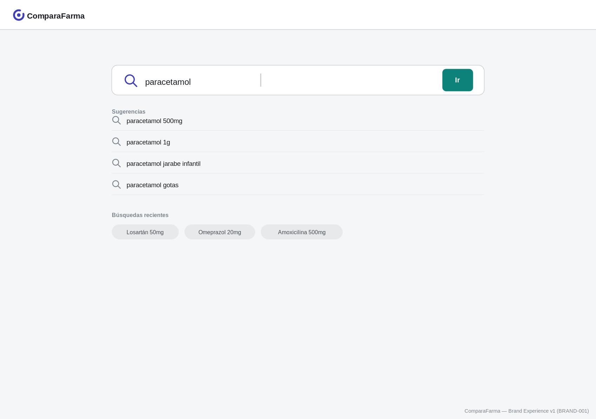

### Resultados

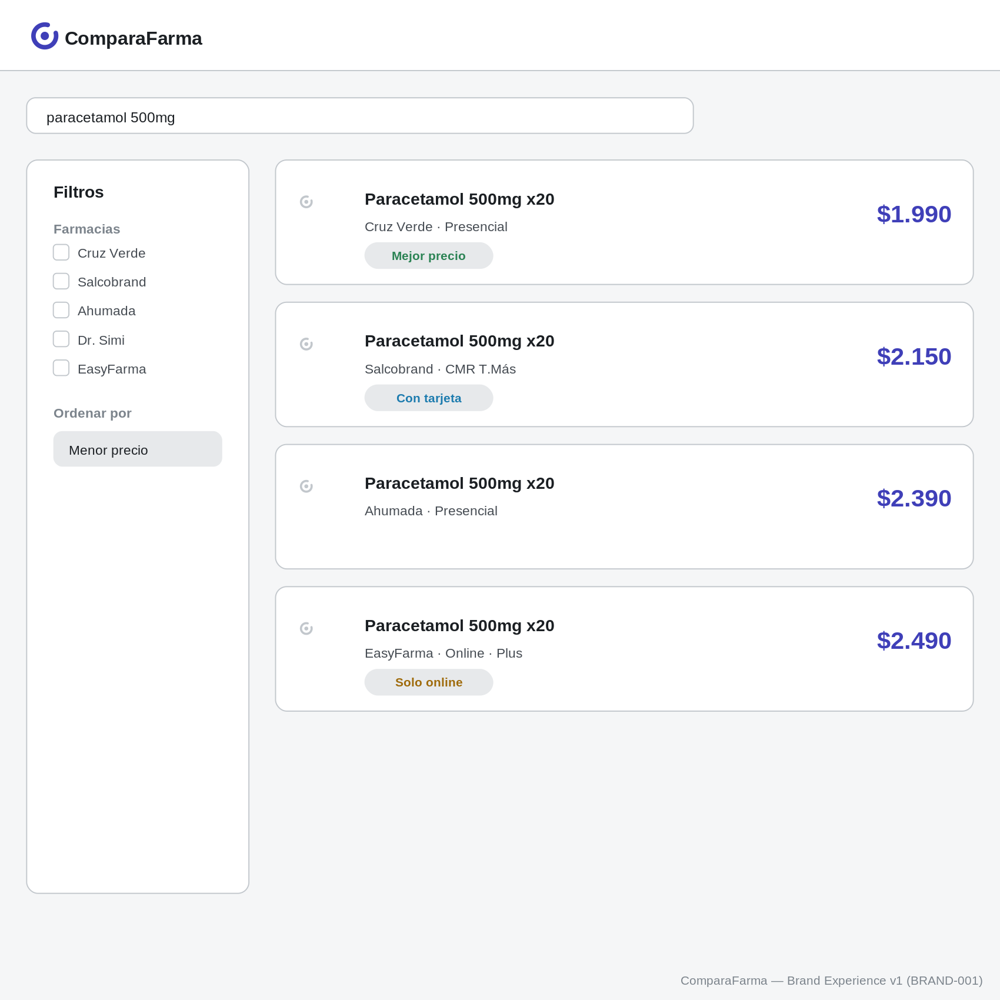

### Ficha del medicamento

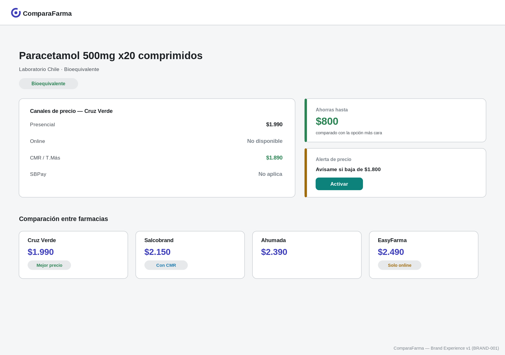

### Dashboard

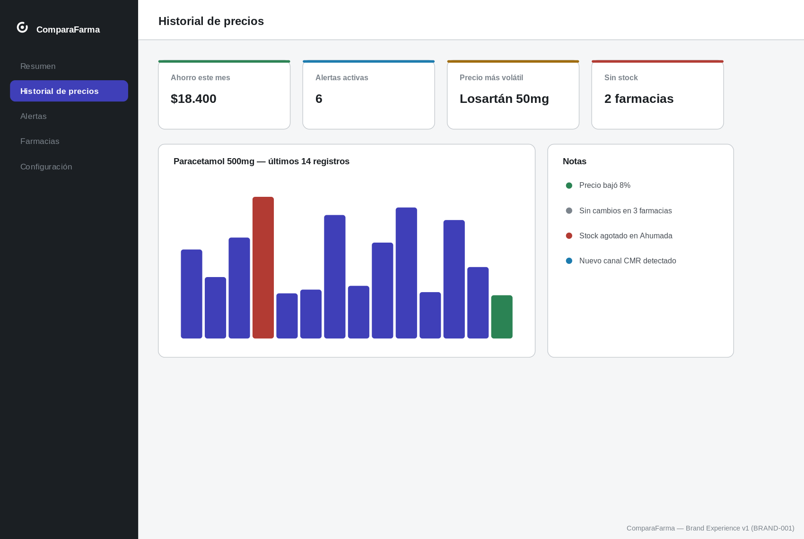

### Header (estados)

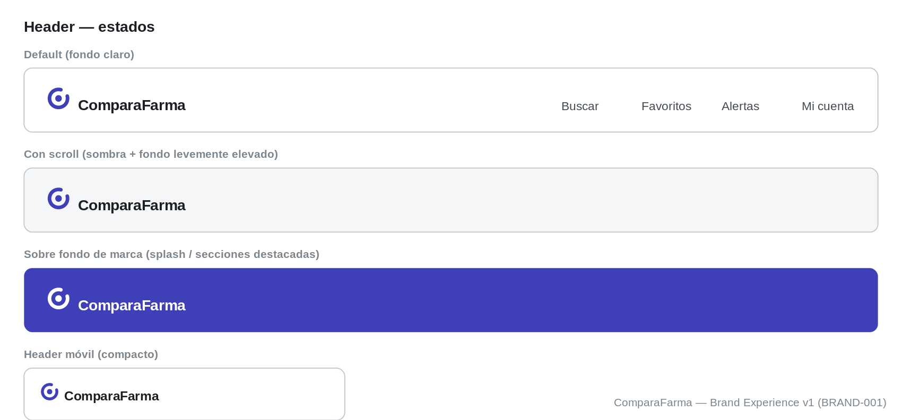

### Footer

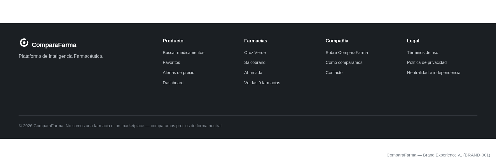

### App Icon aplicado

Identidad aplicada al ícono, no rediseñada — mismo isotipo Candidato 09.

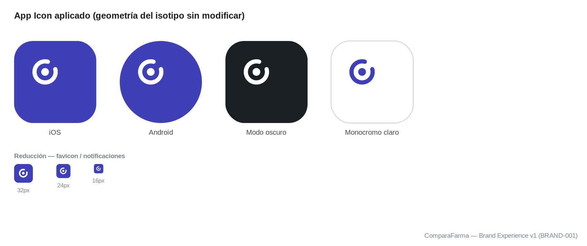

### Splash

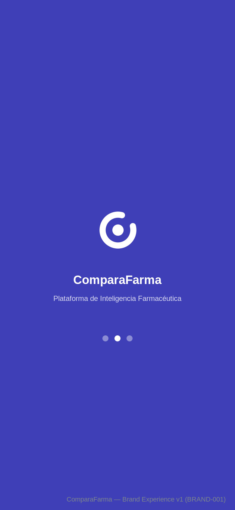

---

## 4. Componentes principales

Botón primario, botón secundario, card, search, badge, alert (4 estados de Feedback), tabla comparativa de farmacias, precio destacado.

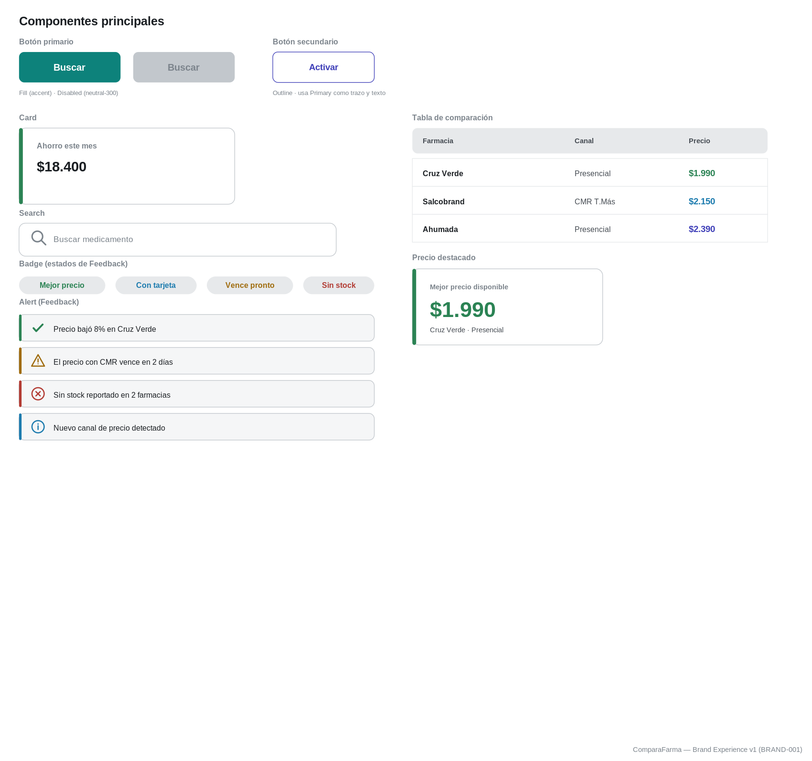

---

## 5. Iconografía aplicada

Dirección Lucide ya aprobada: trazo de línea simple, grosor constante, esquinas redondeadas, grilla de 24px. Los íconos de este documento (búsqueda, corazón, campana, barras, check, alerta, x-circle, info) son construcciones propias en esa misma lógica visual — no exportaciones literales de la librería Lucide, sino la aplicación consistente de su lenguaje de trazo en los componentes mostrados arriba (badges, alerts, header, tab bar).

---

## 6. Signature Components v1 (BRAND-003)

`DISTINCTIVE_PRODUCT_IDENTITY.md` (BRAND-002) propuso seis elementos exclusivos para que ComparaFarma sea reconocible sin depender del logo. Ese sprint fue conceptual — justificación, beneficio, prioridad — pero no produjo componentes visuales reales. `docs/design/product/SIGNATURE_COMPONENTS.md` cierra esa distancia: define tamaño, grosor, radios, variantes y estados de los siete componentes (los seis propuestos más el Empty State, patrón ya vigente) y los muestra aplicados con datos reales.

Los siete comparten la misma familia de radios (10 / 8 / 6), el mismo grosor de trazo de datos (6-8px) y la misma disciplina de color: Accent para cualquier métrica propia del producto (Savings Arc), Success reservado estrictamente para una confirmación puntual (badge "Mejor precio", Price Break Marker en baja) — nunca al revés.

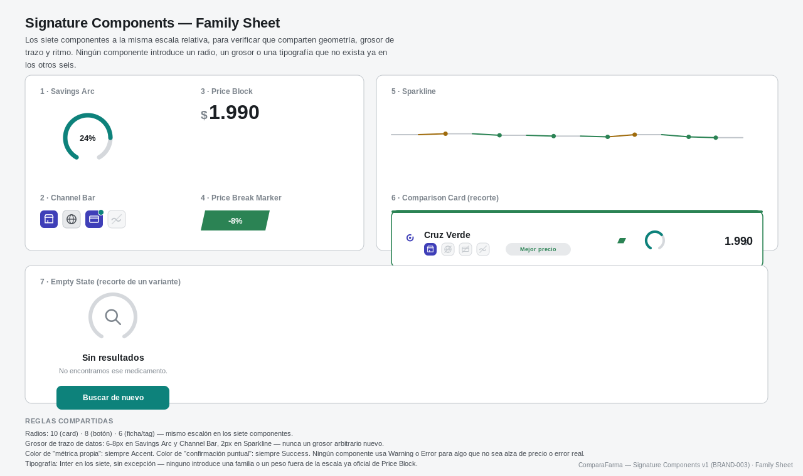

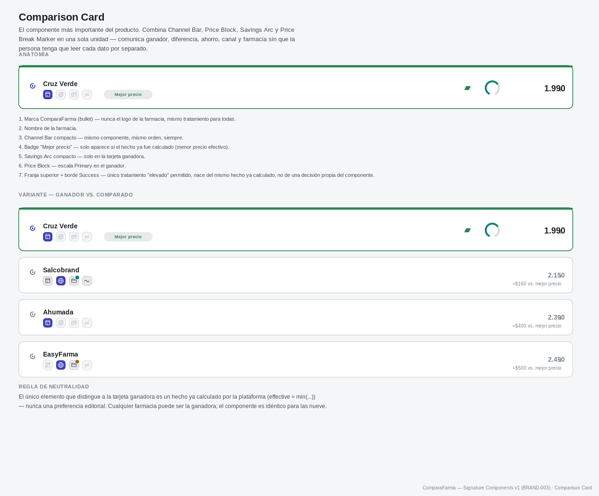

El bloque "Ejemplo real" de la Home Desktop (§3.1) ya adopta el primero de los siete — el Savings Arc — junto al monto "$500", reemplazando el texto plano que tenía en la versión UX-001. Ningún otro mockup de este documento fue modificado: Resultados, Dashboard, Ficha, Header, Footer, App Icon, Splash, Componentes, Tipografía y Color permanecen exactamente como en BRAND-001, a la espera de que el comité apruebe estos siete componentes como especificación oficial antes de aplicarlos al resto de las pantallas.

Detalle completo, incluidos los otros seis sheets (Savings Arc, Channel Bar, Price Block, Price Break Marker, Sparkline, Empty State) y la autoevaluación de firma visual sin logo: `docs/design/product/SIGNATURE_COMPONENTS.md`.

## Cierre

Esta es la primera experiencia visual completa de ComparaFarma bajo la dirección "Intelligence" ya aprobada. No se presentan alternativas — **una única dirección, una única experiencia**, tal como fue solicitado.

La pregunta para el comité: **¿Así queremos que se vea ComparaFarma?**

Si la respuesta es sí: se congela la paleta, se aprueba la tipografía, se inicia `COLOR_SYSTEM`, se inicia `TYPOGRAPHY_SYSTEM`, y comienza la implementación en Web y Mobile.

**Deteniéndose aquí. Esperando aprobación explícita antes de continuar.**
