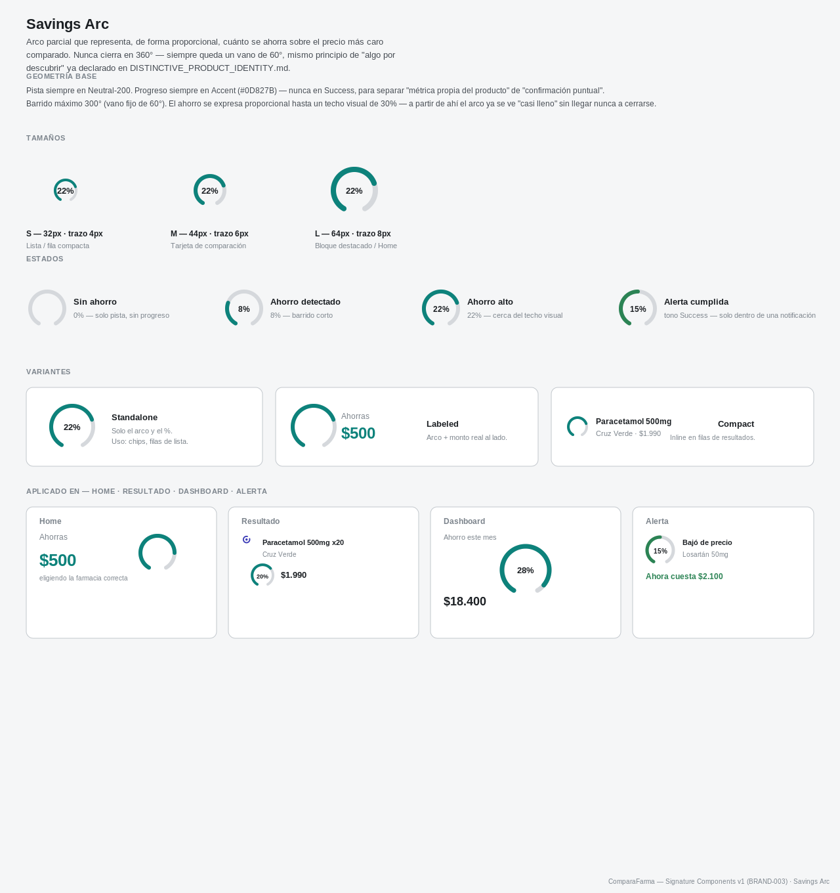
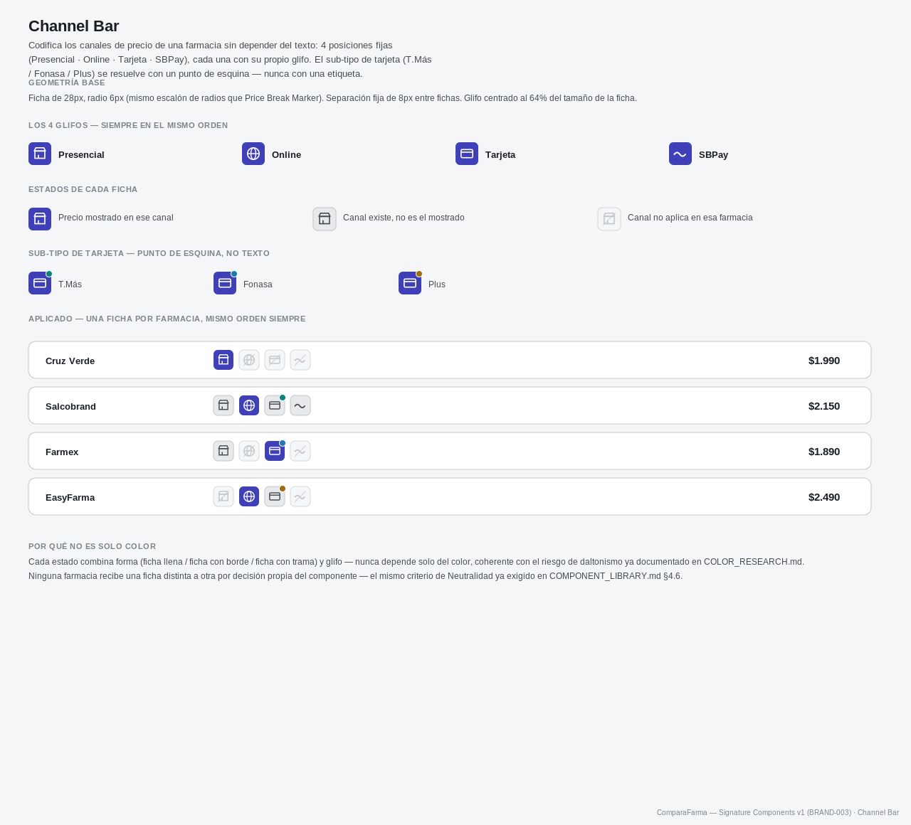
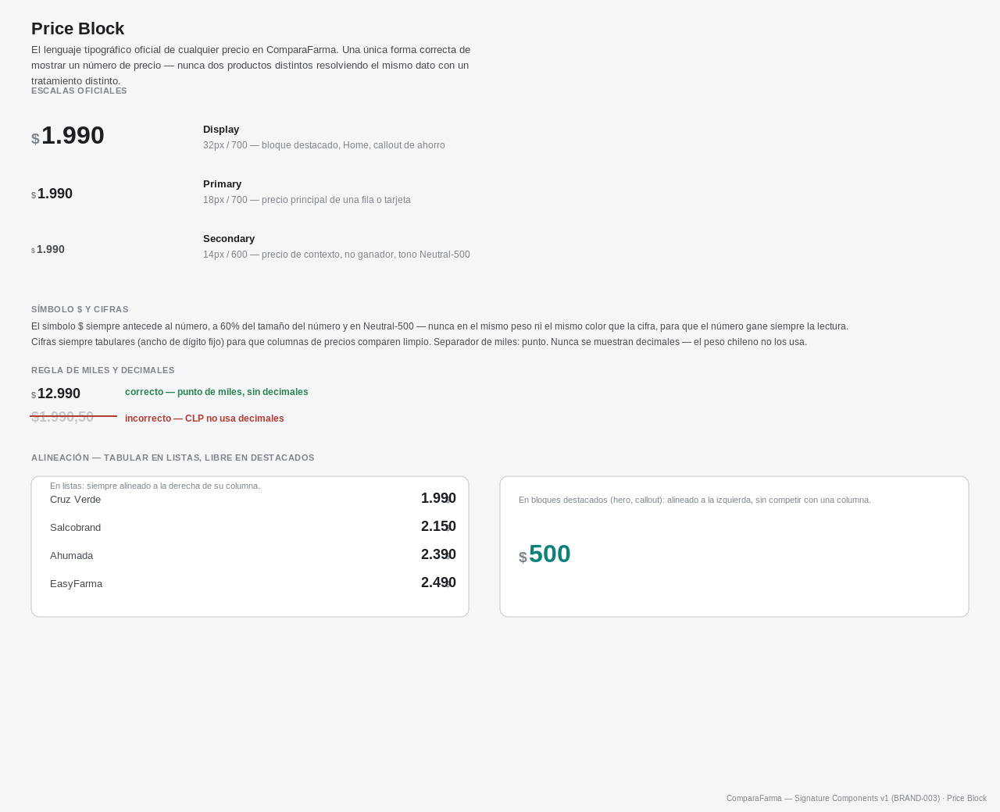
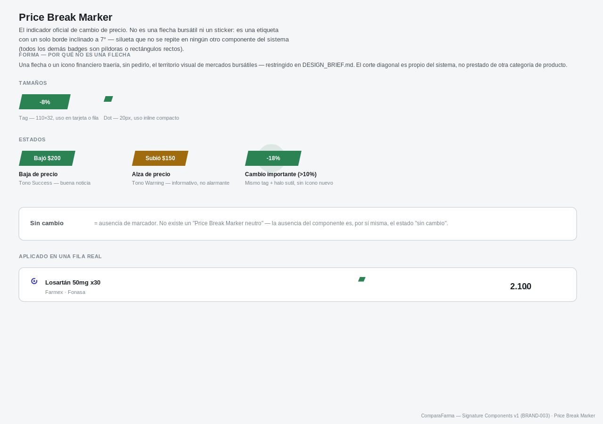
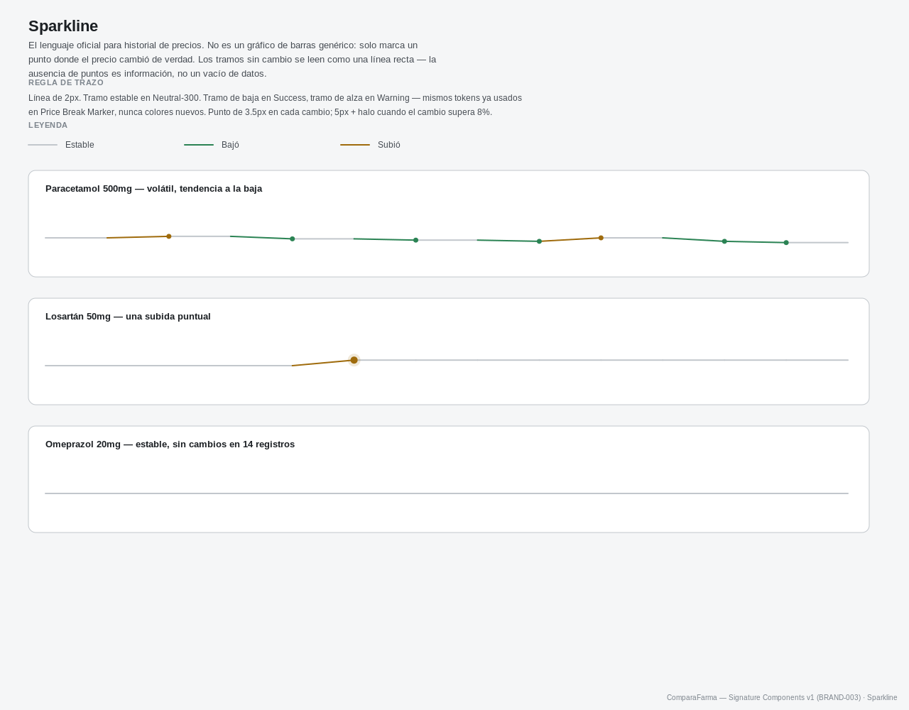
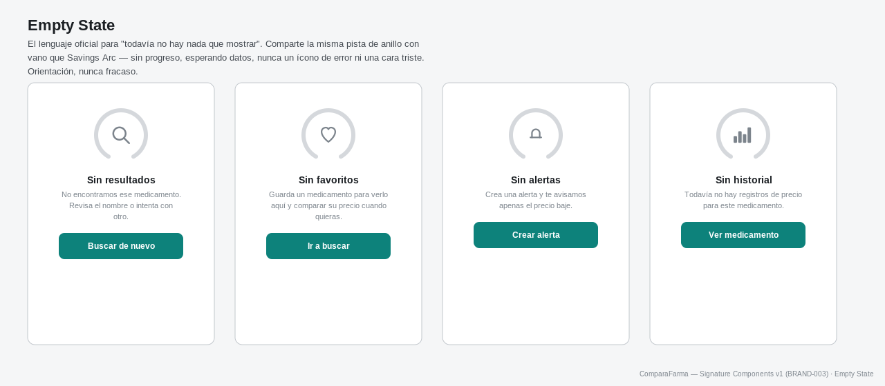

# SIGNATURE_COMPONENTS — Especificación Visual v1 (BRAND-003)

**Naturaleza de este documento:** materialización, no teoría. Transforma los seis conceptos propuestos en `DISTINCTIVE_PRODUCT_IDENTITY.md` (BRAND-002) — más el Empty State, ya vigente como patrón de contenido — en siete componentes visuales completos: tamaño, grosor, radios, variantes, estados y ejemplos aplicados. No reabre investigación, benchmark ni exploración. No cambia color, tipografía, iconografía ni Design System — cada componente consume exclusivamente tokens ya aprobados en `BRAND_EXPERIENCE_V1.md` (Brand `#3F3FB8`, Accent `#0D827B`, Feedback Success/Warning/Error/Information, Neutral N50-N900, Inter).

Todos los mockups están en `docs/design/assets/signature-components/` (SVG + PNG, generados programáticamente, sin código de producto, sin React, sin CSS, sin Tailwind).

---

## Regla de geometría compartida

Los siete componentes comparten, sin excepción, la misma familia de radios, grosores y color-por-función. Esta tabla es la que hace que "parezcan diseñados por el mismo equipo":

| Constante | Valor | Dónde se usa |
|---|---|---|
| Radio grande | 10px | Card (heredado de `BRAND_EXPERIENCE_V1.md`) |
| Radio medio | 8px | Botón (heredado) |
| Radio pequeño | 6px | Ficha de Channel Bar, mismo escalón que el botón, un paso más chico |
| Grosor de trazo — dato | 6-8px, escala con el tamaño | Anillo de Savings Arc, mismo grosor conceptual que el acento de 6px ya usado en las tarjetas de estadística de Home |
| Grosor de trazo — línea fina | 2px | Sparkline |
| Vano fijo | 60° | Savings Arc y Empty State — la misma pista de anillo, nunca un círculo completo |
| Color de "métrica propia" | Accent `#0D827B` | Savings Arc (siempre), nunca en Success |
| Color de "confirmación puntual" | Success `#2B8354` | Badge "Mejor precio", Price Break Marker (baja), Empty State no aplica color — solo Savings Arc y Price Break Marker distinguen este par |
| Tipografía | Inter, sin excepción | Los siete componentes |

Ningún componente introduce un radio, un grosor o un color que no esté ya en esta tabla.

---

## 1. Savings Arc

Arco parcial (nunca un círculo cerrado) que representa, proporcionalmente, cuánto se ahorra sobre el precio más caro comparado.

- **Geometría:** pista completa en Neutral-200, barrido máximo de 300° (vano fijo de 60°). El progreso se expresa proporcional hasta un techo visual de 30% de ahorro — a partir de ahí el arco se ve "casi lleno" sin llegar nunca a cerrarse en 360°, para no confundirse con el isotipo.
- **Tamaños:** S — 32px / trazo 4px (listas y filas compactas). M — 44px / trazo 6px (tarjeta de comparación). L — 64px / trazo 8px (bloque destacado de Home).
- **Variantes:** Standalone (solo arco + %), Labeled (arco + monto real, ej. "$500"), Compact (inline, dentro de una fila de resultados).
- **Estados:** Sin ahorro (0%, solo pista), Ahorro detectado (barrido corto), Ahorro alto (cerca del techo visual), Alerta cumplida (mismo arco en tono Success, exclusivo del contexto de notificación).
- **Aplicado en:** Home (bloque "Ejemplo real"), Resultado (fila de comparación), Dashboard (estadística "Ahorro este mes"), Alerta (confirmación de baja de precio) — las cuatro aplicaciones requeridas están documentadas dentro del propio sheet.

## 2. Channel Bar

Codifica los canales de precio de una farmacia sin depender del texto.

- **Geometría:** 4 fichas fijas de 28px, radio 6px, separación de 8px, siempre en el mismo orden: Presencial → Online → Tarjeta → SBPay. Cada ficha lleva su propio glifo (tienda, globo, tarjeta, onda) — nunca una letra ni una etiqueta.
- **Sub-tipo de tarjeta:** T.Más / Fonasa / Plus se distinguen con un punto de esquina de 4.5px (Accent / Information / Warning respectivamente) sobre el mismo glifo de tarjeta — nunca con texto adicional.
- **Estados por ficha:** Activo (relleno Primary, el canal que se está mostrando), Disponible (relleno Neutral-100 con borde, existe pero no es el mostrado), No aplica (relleno claro con trama diagonal, ese canal no existe en esa farmacia).
- **Accesibilidad:** cada estado combina forma y glifo, nunca solo color — mismo criterio de daltonismo ya documentado en `COLOR_RESEARCH.md`.
- **Neutralidad:** el mismo componente, en el mismo orden, se usa para las nueve farmacias — ninguna recibe un tratamiento propio.

## 3. Price Block

La única forma oficial de mostrar un precio en ComparaFarma.

- **Escalas:** Display — 32px/700 (bloque destacado, Home, callout de ahorro). Primary — 18px/700 (precio principal de una fila o tarjeta). Secondary — 14px/600, color Neutral-500 (precio de contexto, no ganador).
- **Símbolo $:** siempre antes del número, a 60% del tamaño de la cifra, en Neutral-500 y peso 600 — nunca compite en peso ni color con el número.
- **Cifras:** tabulares (ancho de dígito fijo, `font-feature-settings: "tnum"` en la implementación real) para que columnas de precios comparen limpio. Separador de miles: punto. Nunca se muestran decimales — el peso chileno no los usa.
- **Alineación:** derecha dentro de su columna en cualquier lista o tabla; libre (izquierda) en bloques destacados que no compiten con una columna.

## 4. Price Break Marker

El indicador oficial de cambio de precio — sin flechas bursátiles, sin iconografía financiera, sin stickers.

- **Forma:** etiqueta con un único borde inclinado a 7° (silueta que no se repite en ningún otro componente — todos los demás badges del sistema son píldoras o rectángulos rectos). Variante compacta: el mismo corte diagonal reducido a un punto de 20px, sin texto, para uso inline.
- **Estados:** Baja de precio (tono Success, "buena noticia"), Alza de precio (tono Warning, informativo, nunca alarmante), Cambio importante — mismo tag con un halo sutil detrás, sin ícono nuevo.
- **Regla de ausencia:** no existe un "marcador neutro". Cuando el precio no cambió, el marcador simplemente no aparece — la ausencia del componente es, por sí misma, el estado "sin cambio".

## 5. Sparkline

El lenguaje oficial de historial de precios — no un gráfico de barras genérico.

- **Trazo:** línea de 2px. Tramo estable en Neutral-300 (se lee como una recta). Tramo de baja en Success, tramo de alza en Warning — mismos tokens ya usados en Price Break Marker, ningún color nuevo.
- **Puntos:** solo se dibuja un punto donde el precio cambió de verdad — 3.5px en un cambio normal, 5px + halo cuando el cambio supera 8% ("cambio importante").
- **Lectura:** un tramo sin puntos es información (estabilidad), no un vacío de datos — la ausencia de marcas es, otra vez, parte del lenguaje del sistema, igual que en Price Break Marker.

## 6. Comparison Card

El componente más importante del producto — combina los cinco anteriores en una sola unidad.

- **Anatomía:** marca ComparaFarma (bullet, nunca el logo de la farmacia) → nombre de farmacia → Channel Bar compacto → badge "Mejor precio" (solo si corresponde) → Savings Arc compacto (solo en la ganadora) → Price Block → franja superior y borde en Success (único tratamiento "elevado" permitido).
- **Variante Ganador:** Price Block en escala Primary, Savings Arc visible, franja Success de 4px, borde de 1.6px.
- **Variante Comparado:** Price Block en escala Secondary (tono Neutral-500), sin arco, sin franja, borde estándar de 1px, con una línea de diferencia ("+$160 vs. mejor precio") para que el costo de no elegir esa farmacia sea explícito sin tener que restar mentalmente.
- **Regla de Neutralidad:** el único elemento que distingue a la tarjeta ganadora es un hecho ya calculado por la plataforma (`effective = min(...)`) — nunca una preferencia editorial. El componente es idéntico para las nueve farmacias; cualquiera puede ser la ganadora.

## 7. Empty State

El lenguaje oficial para "todavía no hay nada que mostrar" — cuatro variantes: sin resultados, sin favoritos, sin alertas, sin historial.

- **Motivo compartido:** la misma pista de anillo con vano de Savings Arc, sin progreso — "esperando datos", no un ícono de error ni una ilustración de fracaso.
- **Estructura:** anillo + glifo funcional centrado (búsqueda, corazón, campana, barras — los mismos íconos ya usados en el resto del producto) + título + mensaje de orientación en una o dos líneas + una única acción (botón Accent) que siempre mueve a la persona hacia adelante, nunca la deja "atascada".
- **Tono:** ninguna variante usa lenguaje de error, urgencia o disculpa — coherente con `ICONOGRAPHY_SYSTEM.md` §4.2.6, que ya exige evitar cualquier lectura de urgencia agresiva incluso en avisos negativos.

---

## Family Sheet — verificación de consistencia

Los siete componentes a la misma escala relativa, uno junto al otro, para verificar en un solo vistazo que ninguno introduce un radio, un grosor, una tipografía o un uso de color fuera de la tabla de la sección "Regla de geometría compartida".

---

## Autoevaluación — firma visual sin logo

> Si oculto el logo de ComparaFarma, ¿estos componentes siguen permitiendo reconocer el producto?

**Sí.** Ningún competidor del benchmark ya aprobado (`VISUAL_BENCHMARK.md`) resuelve, a la vez y con el mismo lenguaje: un arco de ahorro que nunca cierra, una barra de canal de precio sin texto, un precio con una única forma tipográfica oficial, un marcador de cambio con un borde inclinado en vez de una flecha, un historial que solo marca cambios reales, una tarjeta de comparación donde el ganador se distingue por un hecho calculado y no por una decisión editorial, y un estado vacío que comparte la misma pista de anillo que el arco de ahorro. La combinación de las siete piezas, no una sola, es lo que queda como firma — igual conclusión a la que llegó `DISTINCTIVE_PRODUCT_IDENTITY.md` en BRAND-002, ahora materializada.

---

## Cierre

Ningún color, tipografía, ícono, componente ya existente, arquitectura o layout general fue modificado. No se investigó, no se generaron alternativas ni se propuso trabajo futuro más allá de lo solicitado en este sprint.

**Deteniéndose aquí. Esperando aprobación explícita del comité antes de que estos siete componentes se adopten como especificación oficial del Design System.**
