# VISUAL_EXPLORATION — Tres Propuestas Visuales (VISUAL-003)

**Naturaleza de este documento:** exploración visual, no teoría. No modifica ninguna arquitectura de marca, diseño o Design System ya aprobada — solo cambia expresión visual sobre la misma estructura de producto. No se generó código, CSS, Tailwind ni React. No se rediseñó el logo: las tres propuestas aplican, sin cambiar su geometría, el isotipo ya existente (Candidato 09, `docs/design/assets/candidato_09_plano_construccion.svg` — estado "Aprobar con ajustes" según `docs/design/BRAND_IDENTITY_VALIDATION.md`).

Todos los mockups están en `docs/design/assets/visual-exploration/` (SVG + PNG por propuesta). Herramienta usada: generación programática de SVG (Python) renderizada a PNG con CairoSVG — sin Figma, sin librerías de terceros con licencia no verificada. Los mockups son esquemáticos (misma estructura de producto en las tres, para aislar la variable visual), no HTML/CSS de producción.

Mezcla ya aprobada respetada en las tres propuestas: **70% Data Intelligence / 20% Minimal Tech / 10% Human + Technology.** Ninguna propuesta es 100% de un solo eje — cada una **enfatiza** un eje sin abandonar los otros dos.

---

## Propuesta A — Precision

**Concepto:** exactitud, cero ruido, el dato manda. Es la propuesta que más literalmente encarna el 70% Data Intelligence.

| | |
|---|---|
| Home Desktop | 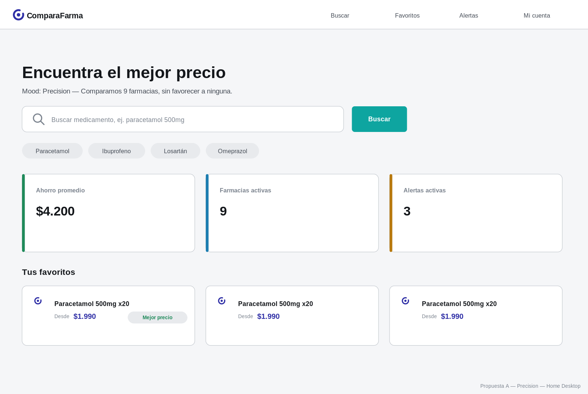 |
| Home Mobile | 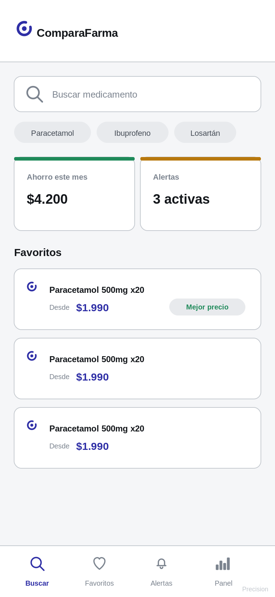 |
| Resultados de búsqueda | 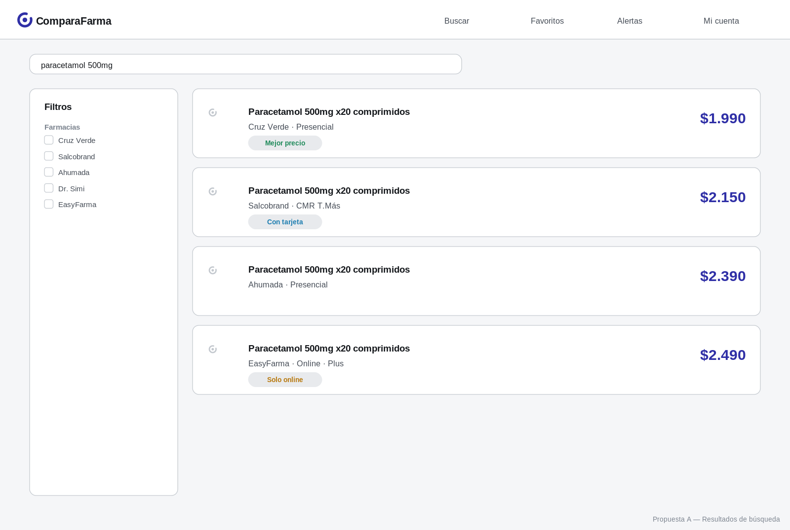 |
| Ficha de medicamento | 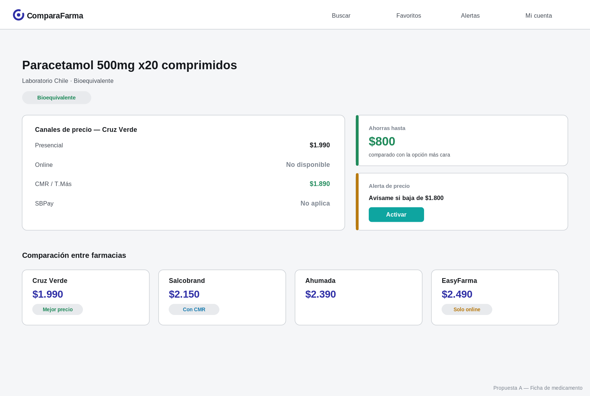 |
| Logo aplicado (Header / Splash / App Icon / Web Header) | 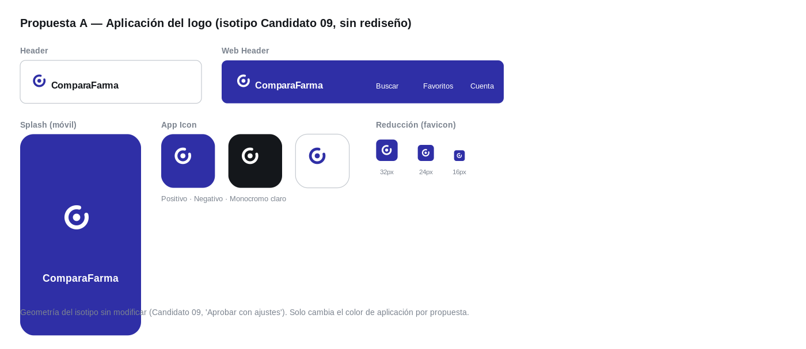 |
| Paleta y tipografía | 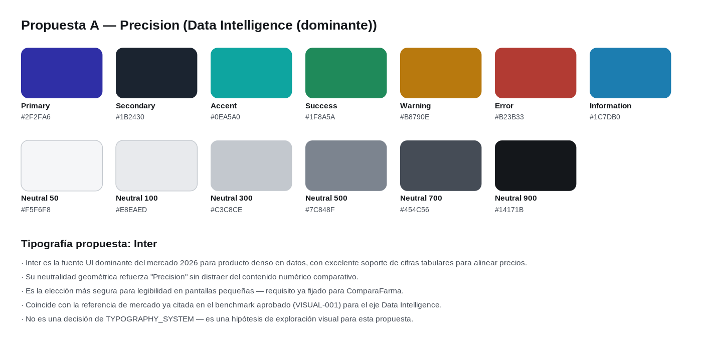 |

**Tipografía:** Inter.
1. Fuente UI dominante del mercado 2026 para producto denso en datos, con cifras tabulares para alinear precios.
2. Su neutralidad geométrica refuerza "Precision" sin distraer del contenido numérico.
3. Máxima legibilidad ya probada en pantallas pequeñas.
4. Coincide con la referencia de mercado ya citada en el benchmark aprobado (VISUAL-001) para Data Intelligence.
5. Exploración visual — no es una decisión de `TYPOGRAPHY_SYSTEM`.

**Espacio / tarjetas / botones / navegación / estados:** grilla apretada, radios pequeños (6–10px), bordes finos de 1px, filtros en sidebar fija, botones rectangulares con esquina mínima, badges de estado siempre con texto + color (nunca solo color).

---

## Propuesta B — Confidence

**Concepto:** autoridad silenciosa, disciplina de un solo acento. Es la propuesta que más enfatiza el 20% Minimal Tech.

| | |
|---|---|
| Home Desktop | 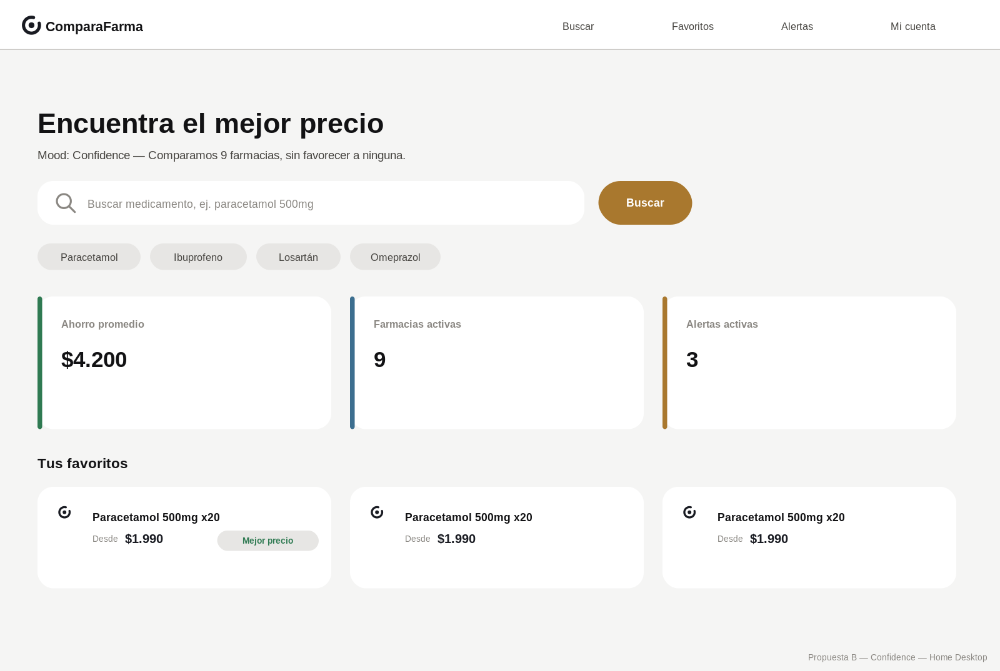 |
| Home Mobile | 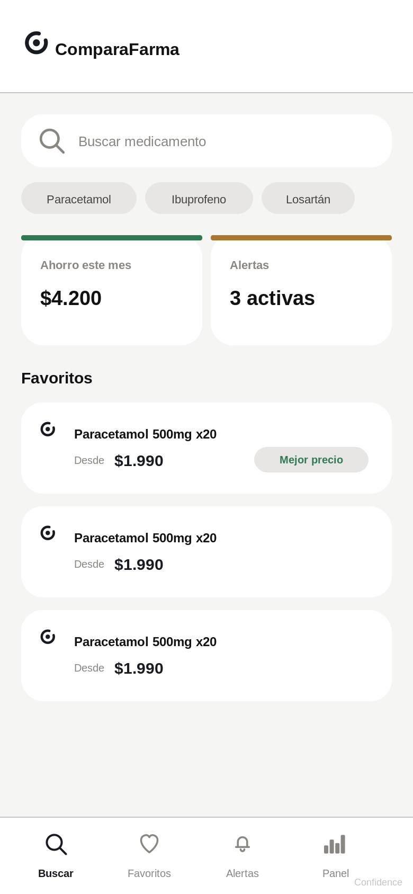 |
| Resultados de búsqueda | 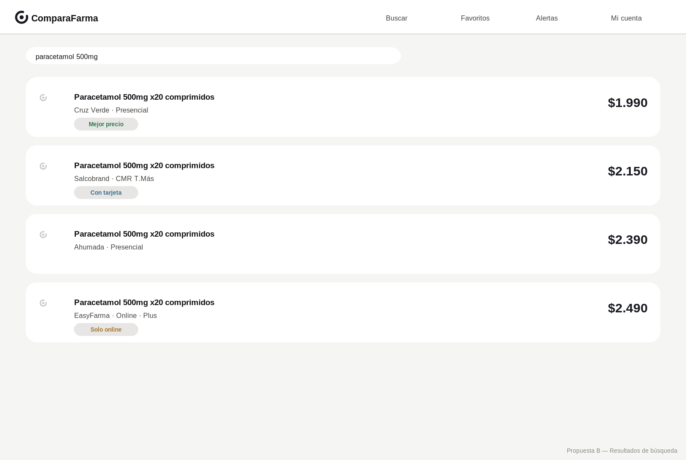 |
| Ficha de medicamento | 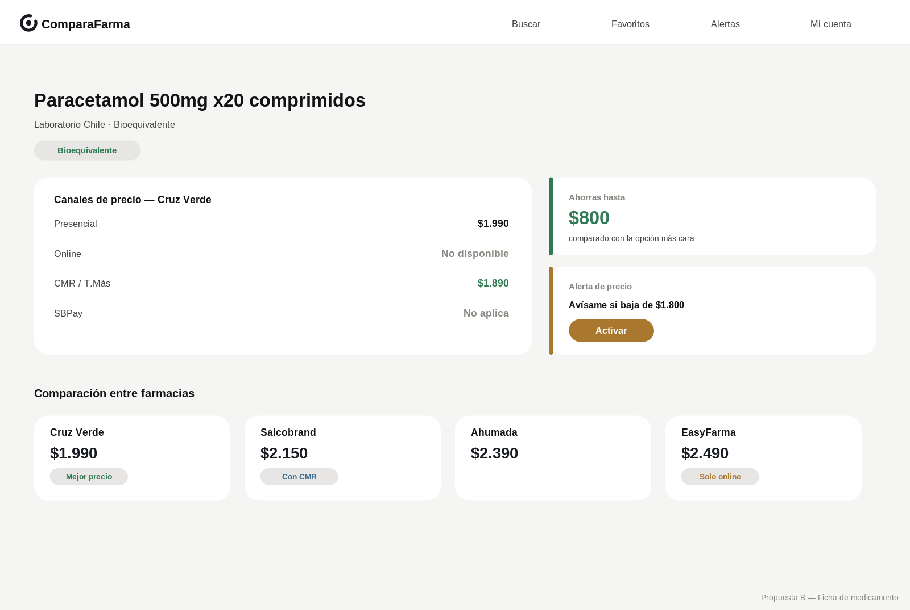 |
| Logo aplicado | 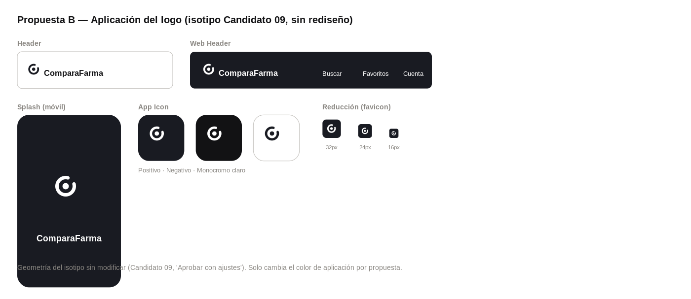 |
| Paleta y tipografía | 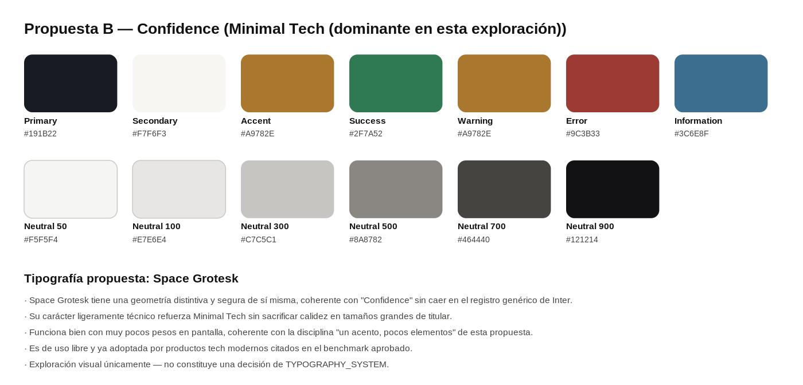 |

**Tipografía:** Space Grotesk.
1. Geometría distintiva y segura de sí misma, coherente con "Confidence" sin caer en el registro genérico de Inter.
2. Carácter técnico sin sacrificar calidez en titulares grandes.
3. Funciona con muy pocos pesos en pantalla, coherente con la disciplina "un acento, pocos elementos".
4. Ya adoptada por productos tech modernos citados en el benchmark aprobado.
5. Exploración visual — no es una decisión de `TYPOGRAPHY_SYSTEM`.

**Espacio / tarjetas / botones / navegación / estados:** whitespace generoso, tarjetas sin borde (solo sombra sutil), radios grandes (16–20px), botones tipo píldora, un único acento bronce usado con moderación extrema, filtros colapsados en una píldora en vez de sidebar.

---

## Propuesta C — Guidance

**Concepto:** acompañar sin empujar — la expresión visual más directa del concepto de marca ya aprobado "Orientación". Es la propuesta que más enfatiza el 10% Human + Technology, sin invertir la prioridad sobre los otros dos ejes.

| | |
|---|---|
| Home Desktop | 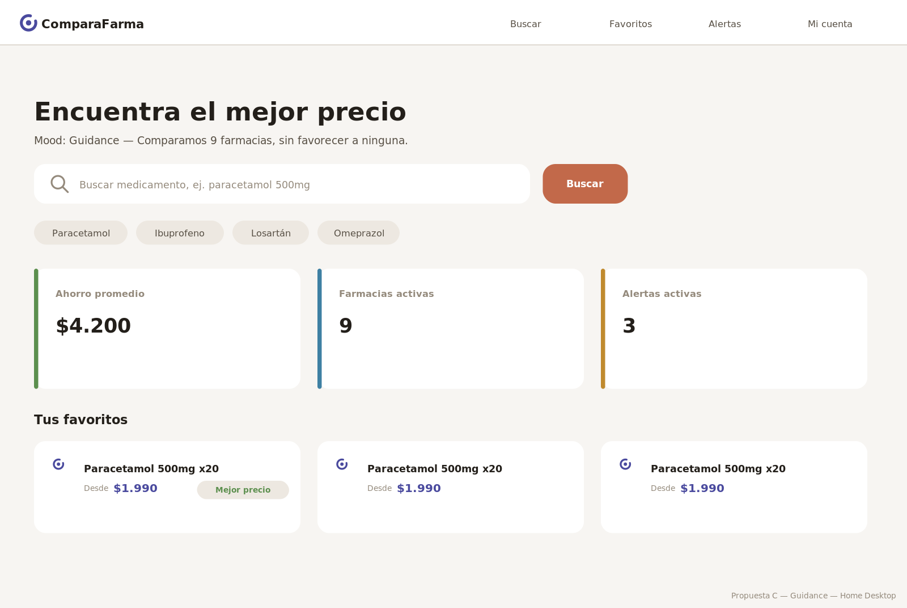 |
| Home Mobile | 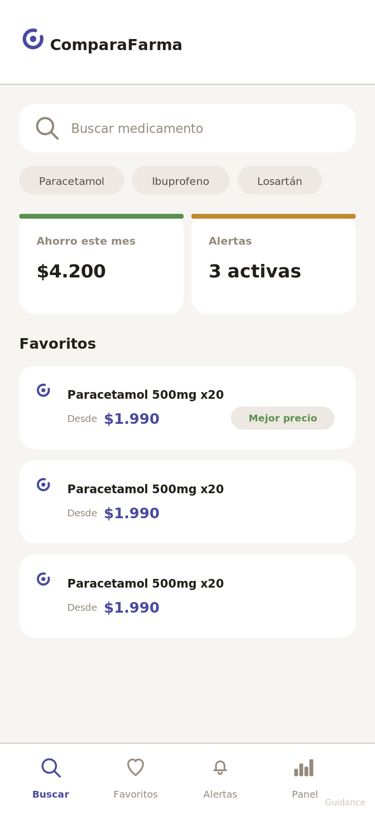 |
| Resultados de búsqueda | 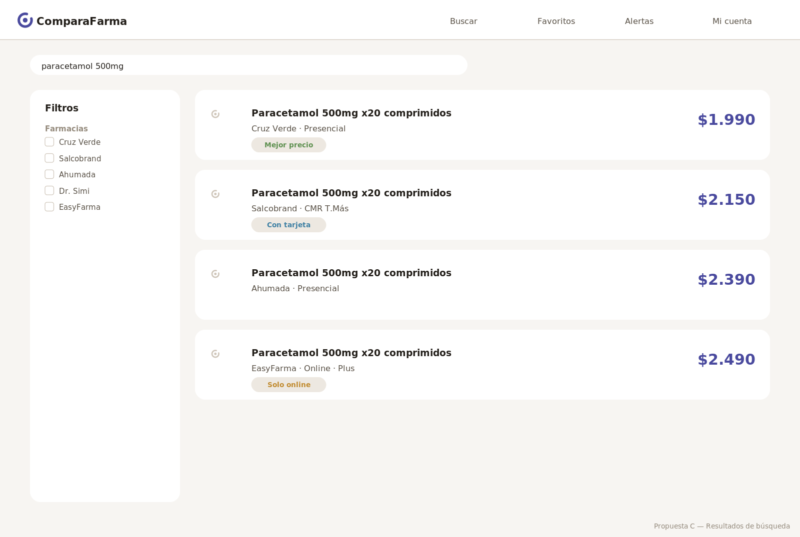 |
| Ficha de medicamento | 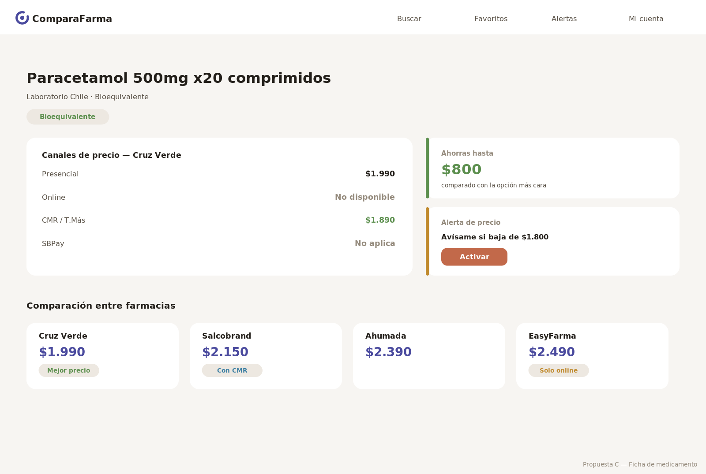 |
| Logo aplicado | 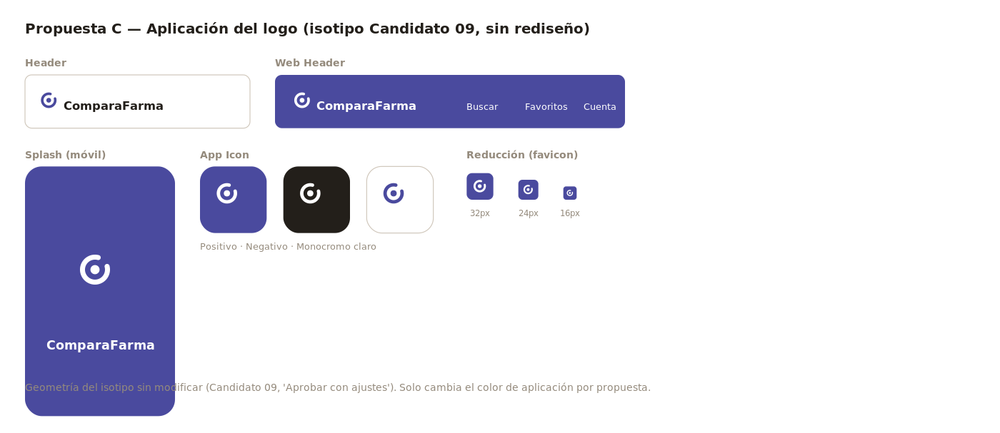 |
| Paleta y tipografía | 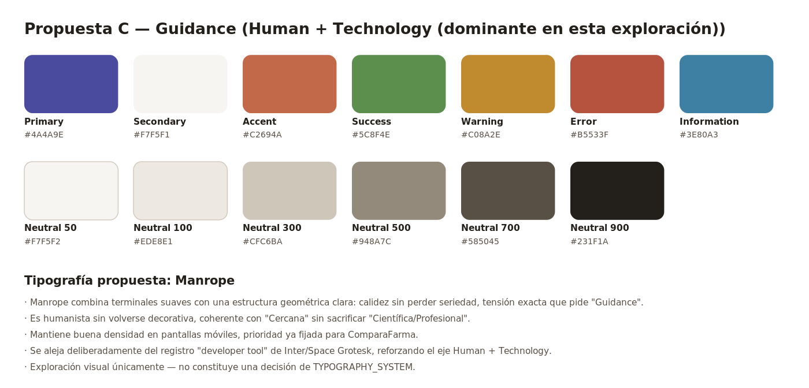 |

**Tipografía:** Manrope.
1. Terminales suaves + estructura geométrica clara: calidez sin perder seriedad, exactamente la tensión que pide "Guidance".
2. Humanista sin volverse decorativa — sostiene "Cercana" sin sacrificar "Científica/Profesional".
3. Buena densidad en pantallas móviles, prioridad ya fijada para ComparaFarma.
4. Se aleja deliberadamente del registro "developer tool" de A y B, reforzando Human + Technology.
5. Exploración visual — no es una decisión de `TYPOGRAPHY_SYSTEM`.

**Espacio / tarjetas / botones / navegación / estados:** superficies con temperatura cálida (crema, no blanco puro), radios medios-grandes (12–16px), botones redondeados (no píldora completa), acento terracota reservado para la acción principal y para el estado "Mejor precio", tab bar inferior más presente en mobile.

---

## Comparación rápida

| | A — Precision | B — Confidence | C — Guidance |
|---|---|---|---|
| Eje dominante | Data Intelligence | Minimal Tech | Human + Technology |
| Primary | `#2F2FA6` (indigo saturado) | `#191B22` (grafito) | `#4A4A9E` (indigo cálido) |
| Accent | `#0EA5A0` (teal) | `#A9782E` (bronce, único acento) | `#C2694A` (terracota) |
| Superficie base | Gris frío | Blanco cálido | Crema |
| Radios | 6–10px | 16–20px (píldora) | 12–16px |
| Tipografía | Inter | Space Grotesk | Manrope |
| Navegación resultados | Sidebar de filtros fija | Píldora de filtros colapsable | Sidebar ligera + tab bar mobile marcado |

Isotipo idéntico en las tres — mismo trazo, mismo punto central, solo cambia el color de aplicación, consistente con `LOGO_SYSTEM.md` §4.5 (versiones Positivo / Negativo / Monocromo).

---

## Cierre

Ninguna propuesta se recomienda por sobre las otras. El objetivo es que el Product Manager compare visualmente las tres identidades y seleccione una.

No se modificó ningún archivo existente. No se generó código, CSS, Tailwind ni React. No se actualizó documentación de Brand, Design ni Design System. No se escribió ningún RFC ni ningún principio nuevo.

**Una vez seleccionada una dirección: se cierra VISUAL-003, se inicia `COLOR_SYSTEM`, se inicia `TYPOGRAPHY_SYSTEM`, y se inicia la implementación en Web y Mobile.**

**Deteniéndose aquí. Esperando aprobación explícita antes de continuar.**
