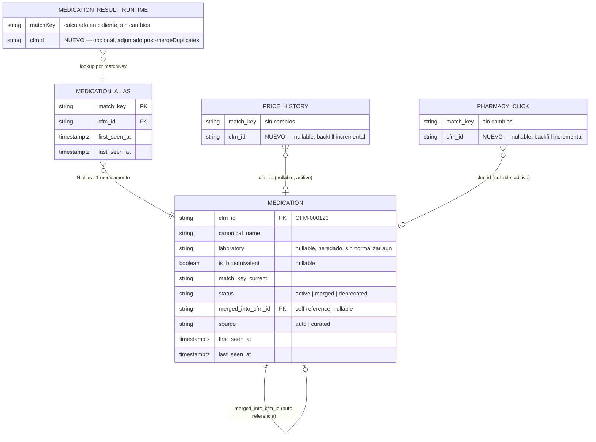

# RFC-002 — Canonical Medication Registry (CFM-ID)

| Campo | Valor |
|---|---|
| **ID** | RFC-002 |
| **Título** | Canonical Medication Registry — identidad permanente para medicamentos, coexistiendo con `matchKey` |
| **Estado** | Propuesto (no implementado) |
| **Fecha** | 2026-07-21 |
| **Autor** | Claude Code (Principal SE) |
| **Revisores** | CTO, Tech Lead |
| **Documentos relacionados** | `docs/architecture/DOMAIN_MODEL.md` (§6 — Oportunidades hacia un Pharmaceutical Knowledge Graph), ADR-0001, `docs/normalization.md`, `docs/database/schema.sql` |
| **Prioridad** | Media — es infraestructura habilitante, no resuelve un bug activo |

---

## 1. Resumen Ejecutivo

### El problema

`matchKey` (`packages/domain/src/matching.ts`) cumple dos roles a la vez: es el **algoritmo de fusión** de resultados de búsqueda (correcto y necesario, no se toca) y, por accidente, la **única noción de identidad** de un medicamento en todo el sistema — es el único campo que conecta un resultado de búsqueda con `price_history`, `pharmacy_clicks`, favoritos y alertas.

Eso es frágil porque `matchKey` **no fue diseñado para ser una identidad estable**: ya cambió 10 veces (`v1`–`v10`, ver `docs/normalization.md` §5) y cada cambio invalida silenciosamente el historial de precios, las alertas y los favoritos existentes (documentado y aceptado como trade-off en RFC-001 §8, "Alertas y favoritos"). No hay forma de decir "este medicamento es el mismo que vimos hace 3 meses" de forma confiable, ni de enriquecerlo con datos que no vienen de un scraper de e-commerce (ver DOMAIN_MODEL.md §5–6: indicaciones, contraindicaciones, registro ISP, etc. se descartan hoy).

### La propuesta

Agregar una entidad `Medication` con un identificador permanente (`CFM-ID`, ej. `CFM-000123`) que:
- **No reemplaza `matchKey`** — el algoritmo de matching, `mergeDuplicates`, `effectivePrice` y todo `packages/domain` quedan exactamente iguales.
- Vive como una capa de **persistencia e identidad** por encima del resultado ya fusionado, con una tabla de alias `match_key → cfm_id` que absorbe los cambios de versión del algoritmo sin perder continuidad histórica.
- Se registra **de forma automática y best-effort** (mismo patrón de degradación elegante que `appConfigDb.ts`/`priceHistoryDb.ts`/`feedbackDb.ts`) — si Supabase no responde, el sistema funciona exactamente como hoy, sin `cfmId`.
- Se expone como un campo **opcional y aditivo** (`cfmId: string | null`) en `MedicationResult` — nunca reemplaza ni renombra un campo existente.

### Qué NO cambia con este RFC (garantías explícitas pedidas)

- **`matchKey` no se toca.** Ni el algoritmo, ni su formato, ni su uso en `mergeDuplicates`.
- **La API `/api/search` no tiene breaking changes.** Solo gana un campo opcional en la respuesta.
- **Mobile no requiere ningún cambio de código**, y por lo tanto ningún nuevo build ni OTA update — relevante porque `mobile/` está en Prueba Cerrada de Google Play (ver restricción activa en `CLAUDE.md`) y cualquier cambio ahí hoy es indeseable incluso si fuera trivial.
- **Web no requiere cambios** para seguir funcionando — puede empezar a consumir `cfmId` cuando quiera, no es un requisito de este RFC.

---

## 2. Estado Actual (resumen — detalle completo en DOMAIN_MODEL.md)

- `MedicationResult.matchKey` es un string derivado de texto libre, recalculado en cada búsqueda (`packages/domain/src/matching.ts`).
- La única persistencia real que referencia un "medicamento" es la tabla `price_history` (Supabase), vía la columna `match_key text` — sin restricción de integridad referencial hacia ningún catálogo (`docs/database/schema.sql:18`).
- `pharmacy_clicks` también usa `match_key text` como único puente hacia "qué medicamento" (`docs/database/schema.sql:32`).
- No existe ninguna tabla `medications` ni equivalente hoy.
- El pipeline de búsqueda relevante es: `searchService.ts: searchMedicationsDetailed()` → `mergeDuplicates()` (de `@comparafarma/domain`) → `await recordPriceHistory(results).catch(() => {})` → return. **Este `recordPriceHistory` se espera (`await`) dentro del handler**, no es fire-and-forget tras la respuesta — no hay `waitUntil` ni ejecución en background en esta base de código; el patrón existente es "awaited, pero con `.catch(() => {})` para que un fallo de Supabase no rompa la búsqueda". El diseño de este RFC sigue exactamente ese mismo patrón, por consistencia y porque ya es el patrón aceptado en producción.
- Ese `await recordPriceHistory()` solo ocurre en el camino de **cache-miss** de Redis (`getCachedSearch` no encontró nada) — es decir, el presupuesto de latencia adicional que ya se acepta hoy para escribir en Supabase es exactamente el mismo presupuesto en el que este RFC va a apoyarse, no uno nuevo.

---

## 3. Objetivos

### Qué resuelve este RFC
- ✅ Da a cada "medicamento" (a la granularidad que ya usa `mergeDuplicates`, no más fina) un identificador permanente, auditable, independiente de la versión de `matchKey`.
- ✅ Permite que un cambio futuro de `matchKey` (v11, v12...) no rompa el historial: los `match_key` viejo y nuevo pueden apuntar al mismo `CFM-ID` vía la tabla de alias.
- ✅ Da un punto de anclaje estable para enriquecer datos en el futuro (laboratorio normalizado, bioequivalencia con fuente/fecha, principio activo, ATC — ver DOMAIN_MODEL.md §6) sin depender de que el texto del nombre no cambie.
- ✅ Da soporte a "fusionar" dos identidades que en el futuro se determine que son el mismo medicamento (`status = 'merged'` + puntero de redirección), algo que hoy es estructuralmente imposible (no hay dónde registrar esa decisión).

### Qué NO resuelve este RFC (fuera de alcance, explícito)
- ❌ No modela principio activo, forma farmacéutica ni presentación como entidades separadas — `Medication` queda a la misma granularidad que un `MedicationResult` fusionado hoy (ej. "Paracetamol 500 mg x20"). Separar esas capas es la evolución descrita en DOMAIN_MODEL.md §6 y queda para un RFC posterior.
- ❌ No construye un panel de curación/admin para revisar y fusionar medicamentos — se deja como fase opcional futura (§7, Fase 6).
- ❌ No migra los `matchKey` ya usados por favoritos/alertas en el dispositivo — siguen funcionando exactamente igual que hoy (comparación de string), el `CFM-ID` es invisible para mobile a menos que se decida consumirlo en el futuro.
- ❌ No resuelve la calidad de dato heterogénea entre farmacias (bioequivalencia detectada por regex en algunas, `hasStock` hardcodeado en otras — DOMAIN_MODEL.md §5). El registro hereda esa incertidumbre, no la corrige.

---

## 4. Opciones evaluadas

### Opción A — Usar `matchKey` directamente como clave primaria persistente
Guardar `medications` con `match_key` como PK, sin capa de alias.

| | |
|---|---|
| **Ventajas** | Trivial de implementar. |
| **Desventajas** | No resuelve el problema real: la próxima vez que cambie el algoritmo de `matchKey` (ya pasó 10 veces), la tabla se llena de filas huérfanas de nuevo — exactamente el problema que se quiere evitar. |
| **Recomendación** | ❌ Descartada. |

### Opción B — Reemplazar `matchKey` por un ID generado en origen (ej. hash del principio activo + dosis normalizados)
Diseñar un nuevo algoritmo de identidad más robusto y usarlo en vez de `matchKey`.

| | |
|---|---|
| **Ventajas** | Resolvería el problema de raíz de forma más "limpia". |
| **Desventajas** | El usuario pidió explícitamente no tocar `matchKey`. Además, `matchKey` está probado en producción con 38+ tests y varios casos de regresión reales (guiones, short-word merging, día/noche) — reimplementarlo es alto riesgo para bajo beneficio inmediato. |
| **Recomendación** | ❌ Descartada para este RFC (podría revisitarse en el RFC de Knowledge Graph completo). |

### Opción C — Registro canónico con tabla de alias `match_key → CFM-ID` (RECOMENDADA)
Exactamente lo descrito en el Resumen Ejecutivo: `matchKey` sigue siendo el mecanismo de fusión; una tabla nueva traduce `match_key` a una identidad persistente, con soporte de N alias por medicamento.

| | |
|---|---|
| **Ventajas** | No toca código existente probado (`packages/domain`). Absorbe cambios futuros de `matchKey` sin perder continuidad. Reutiliza el patrón de degradación elegante ya validado en el proyecto (`*Db.ts`). Reversible en cada fase. |
| **Desventajas** | Requiere un paso de reconciliación manual cuando el algoritmo de `matchKey` cambie (decidir qué alias viejo corresponde a qué `CFM-ID` no es 100% automatizable — ver Riesgo R-01). |
| **Recomendación** | ✅ Adoptada. |

---

## 5. Arquitectura Propuesta

### 5.1 Principio de diseño

`Medication` es la entidad canónica; `matchKey` es (y sigue siendo) el mecanismo de *fusión en caliente* de resultados de búsqueda. La relación entre ambos es **N:1** — muchos `match_key` (a través del tiempo, a través de variaciones menores de redacción) pueden apuntar a un mismo `CFM-ID`. Nunca al revés: un `match_key` activo apunta a un único `CFM-ID` en un momento dado (constraint de unicidad en la tabla de alias).



### 5.2 Esquema SQL (aditivo — sigue el estilo de `docs/database/schema.sql`, todo `if not exists`)

```sql
-- ============================================================
-- Fase X — Canonical Medication Registry (RFC-002)
-- ============================================================

create sequence if not exists medications_cfm_seq;

create table if not exists medications (
  cfm_id text primary key
    default ('CFM-' || lpad(nextval('medications_cfm_seq')::text, 6, '0')),
  canonical_name text not null,
  laboratory text,
  is_bioequivalent boolean,
  match_key_current text not null,
  status text not null default 'active',        -- 'active' | 'merged' | 'deprecated'
  merged_into_cfm_id text references medications(cfm_id),
  source text not null default 'auto',           -- 'auto' | 'curated'
  first_seen_at timestamptz not null default now(),
  last_seen_at timestamptz not null default now(),
  notes text
);
alter table medications enable row level security;

create table if not exists medication_match_key_aliases (
  match_key text primary key,
  cfm_id text not null references medications(cfm_id),
  first_seen_at timestamptz not null default now(),
  last_seen_at timestamptz not null default now()
);
create index if not exists idx_medication_aliases_cfm_id
  on medication_match_key_aliases(cfm_id);
alter table medication_match_key_aliases enable row level security;

-- Columnas aditivas en tablas existentes — nullable, no rompen nada
alter table price_history add column if not exists cfm_id text references medications(cfm_id);
alter table pharmacy_clicks add column if not exists cfm_id text references medications(cfm_id);
```

**Por qué `cfm_id` es un `text` generado desde una secuencia (no un `bigint identity` con columna derivada)**: usar `nextval()` directamente en el `default` de una columna `text primary key` es atómico en Postgres (las secuencias están diseñadas para esto — sin condición de carrera en la generación del número), y evita mantener dos columnas (`id` interno + `cfm_id` público derivado). El `CFM-ID` es la única clave, en todas partes.

**Formato**: `CFM-######` (6 dígitos, cero-rellenados). Con 6 dígitos hay margen para 999,999 medicamentos antes de necesitar ajustar el formato — muy por encima de cualquier catálogo razonable de medicamentos vendidos en Chile.

**RLS**: igual que las 4 tablas existentes — habilitada como defensa en profundidad, sin policies permisivas. Solo `api/` (con `SUPABASE_SECRET_KEY`) escribe; `web/admin` (fase futura opcional) leería con el mismo mecanismo que ya usa para `feedback`/`clickStats`.

### 5.3 Reglas de identidad

1. **Un `match_key` activo apunta a un único `CFM-ID`** — garantizado por la PK de `medication_match_key_aliases`.
2. **Un `CFM-ID` puede tener múltiples `match_key` histórico-o-simultáneos** (ej. una variante de redacción que otra farmacia produce, o un cambio de versión del algoritmo).
3. **Un `CFM-ID` nunca se reutiliza ni se borra.** Si se determina que dos `CFM-ID` representan el mismo medicamento real (curación manual, fase futura), uno de los dos pasa a `status = 'merged'` con `merged_into_cfm_id` apuntando al que sobrevive — patrón de "tombstone + redirect", no un `DELETE`. Cualquier consumidor que tenga guardado el `CFM-ID` viejo (ej. una futura sincronización de favoritos) puede seguir el puntero.
4. **El registro es automático por defecto** (`source = 'auto'`): la primera vez que se ve un `match_key` nuevo, se crea un `Medication` fila automáticamente, sin intervención humana. `source = 'curated'` queda reservado para cuando (fase futura opcional) alguien revisa y confirma manualmente los atributos.
5. **Nunca se infiere una fusión automáticamente.** Si dos `match_key` distintos parecen ser el mismo medicamento, cada uno obtiene su propio `CFM-ID` — la fusión de identidades es siempre una decisión explícita (manual o, en el futuro, un proceso de reconciliación aparte con su propia revisión), nunca un side-effect silencioso del registro automático.

### 5.4 Dónde vive el código (respeta los límites de arquitectura existentes)

- **`packages/domain`**: gana **un solo cambio aditivo** — el campo opcional `cfmId?: string | null` en la interfaz `MedicationResult` (`packages/domain/src/types.ts`). Ninguna lógica nueva, ninguna dependencia nueva (el paquete sigue sin conocer Supabase, sigue siendo consumible por mobile sin cambios). Esto es intencional: `packages/domain` es compartido con `mobile/`, que no debe (ni puede, no tiene la secret key) hablar con Supabase directamente.
- **`api/src/lib/medicationRegistry.ts`** (nuevo archivo): toda la lógica de lookup/registro, siguiendo el mismo patrón de `appConfigDb.ts`/`priceHistoryDb.ts` (degrada a no-op si Supabase no está configurado).
- **`api/src/services/searchService.ts`**: una línea nueva, en el mismo lugar donde hoy se llama `recordPriceHistory` — se adjunta `cfmId` a los resultados **antes** de esa llamada, para que `price_history`/`pharmacy_clicks` puedan guardar el `cfm_id` en la misma escritura.
- **`web/` y `mobile/`**: **cero cambios requeridos.** Ambos ya reciben `MedicationResult` vía JSON; un campo nuevo y opcional no rompe el parseo en ninguno de los dos (JSON estructural, no hay validación estricta de esquema del lado cliente que rechace campos desconocidos).

### 5.5 Lógica de lookup/registro (pseudocódigo del nuevo módulo)

```typescript
// api/src/lib/medicationRegistry.ts
import { supabase } from "./supabaseClient.js";
import type { MedicationResult } from "./types.js";

// Cache en memoria de proceso — igual filosofía que appConfigDb.ts:
// no hay red compartida entre invocaciones serverless, pero amortiza
// dentro de un mismo contenedor "warm" (mismo trade-off ya aceptado
// en cache.ts / rateLimit.ts).
const aliasCache = new Map<string, string>(); // matchKey -> cfmId

export async function attachCanonicalIds(
  results: MedicationResult[]
): Promise<MedicationResult[]> {
  if (!supabase) return results.map((r) => ({ ...r, cfmId: null }));

  const missing = results
    .map((r) => r.matchKey)
    .filter((k) => !aliasCache.has(k));

  if (missing.length > 0) {
    // 1 round-trip para todo el batch, no N round-trips
    const { data } = await supabase
      .from("medication_match_key_aliases")
      .select("match_key, cfm_id")
      .in("match_key", missing);
    for (const row of data ?? []) aliasCache.set(row.match_key, row.cfm_id);
  }

  const stillMissing = results.filter((r) => !aliasCache.has(r.matchKey));
  await Promise.all(stillMissing.map((r) => registerNew(r).catch(() => {})));

  return results.map((r) => ({ ...r, cfmId: aliasCache.get(r.matchKey) ?? null }));
}

async function registerNew(result: MedicationResult): Promise<void> {
  const { data: med, error } = await supabase!
    .from("medications")
    .insert({
      canonical_name: result.canonicalName,
      laboratory: result.laboratory,
      is_bioequivalent: result.isBioequivalent,
      match_key_current: result.matchKey,
    })
    .select("cfm_id")
    .single();

  if (error || !med) return; // ver R-05 — otra invocación pudo ganar la carrera

  const { error: aliasError } = await supabase!
    .from("medication_match_key_aliases")
    .insert({ match_key: result.matchKey, cfm_id: med.cfm_id });

  if (aliasError) {
    // Conflicto de PK: otra invocación paralela registró este match_key primero.
    // Releer para usar el cfm_id ganador; el `medications` row que insertamos
    // arriba queda huérfano (ver R-05) — barato, se limpia en curación futura.
    const { data: winner } = await supabase!
      .from("medication_match_key_aliases")
      .select("cfm_id")
      .eq("match_key", result.matchKey)
      .maybeSingle();
    if (winner) aliasCache.set(result.matchKey, winner.cfm_id);
    return;
  }

  aliasCache.set(result.matchKey, med.cfm_id);
}
```

Este es el contrato funcional propuesto, no necesariamente el código final línea por línea — la implementación real debe pasar por su propio code review.

### 5.6 Cambio en `searchService.ts` (ilustrativo, aditivo)

```typescript
const results = mergeDuplicates(all).sort((a, b) => a.bestPrice - b.bestPrice);
const withCanonicalIds = await attachCanonicalIds(results);           // NUEVO
await recordPriceHistory(withCanonicalIds).catch(() => {});           // ahora puede guardar cfm_id también
return { results: withCanonicalIds, diagnostics: { ... } };
```

`recordPriceHistory`/`recordClick` (fase posterior, ver §7 Fase 5) pasan a incluir `cfm_id` en el insert/upsert, en paralelo a `match_key` — nunca en reemplazo.

### 5.7 Nuevo endpoint de lectura (opcional, aditivo)

`GET /api/medication?cfmId=CFM-000123` — devuelve la fila de `medications` (para uso futuro de un panel de curación en `web/admin`, o para depuración). Seríamos la 8ª función serverless en `api/api/*.ts` (hoy hay 7: `search`, `health`, `branches`, `config`, `donate`, `feedback`, `go`) — dentro del límite de 12 funciones del plan Hobby documentado en el post-mortem PM-001, con margen de 4 antes del límite. No requiere autenticación especial más allá de lo que ya protege `/api/config` (nada — es dato no sensible), a menos que se decida lo contrario en su propio review.

---

## 6. Compatibilidad — garantías explícitas

### API (`/api/search`, `/api/health`, etc.)
| Aspecto | Estado |
|---|---|
| Campos existentes en `MedicationResult` | ✅ Sin cambios (nombre, tipo, presencia) |
| Campo nuevo `cfmId` | Opcional, `string \| null`. Ausente o `null` si Supabase no está configurado o aún no se registró. |
| Clientes que no leen `cfmId` | ✅ Sin impacto — JSON con un campo extra no rompe ningún parser existente en `mobile/` ni `web/`. |
| Cache Redis (`getCachedSearch`/`setCachedSearch`) | ✅ Sin cambio estructural — `cfmId` viaja dentro del objeto cacheado como cualquier otro campo, una vez adjuntado. |
| Versionado de API | No se requiere — es aditivo, no rompe contrato. |

### Android (mobile)
| Aspecto | Estado |
|---|---|
| Cambios de código requeridos | **Ninguno.** |
| Nuevo build / OTA update requerido | **Ninguno.** Directamente relevante dado que `mobile/` está en Prueba Cerrada de Google Play — este RFC es seguro de implementar en paralelo a esa revisión sin tocarla. |
| `CACHE_PREFIX` (`search_cache_v10_`) | Sin cambios — la estructura de `MedicationResult` que la app *espera* no cambia (solo gana un campo que la app ignora). No hace falta incrementar la versión de caché. |
| Favoritos / alertas existentes | Sin impacto — siguen comparando por `matchKey`, exactamente igual que hoy. |
| Consumo futuro de `cfmId` (opcional) | Cuando `mobile/` salga de Prueba Cerrada, puede empezar a persistir `cfmId` junto a `matchKey` en favoritos/alertas como mejora incremental — no es parte de este RFC. |

### Web
| Aspecto | Estado |
|---|---|
| Cambios de código requeridos | **Ninguno** para mantener el comportamiento actual. |
| Consumo futuro (opcional) | El panel `/admin` podría eventualmente mostrar/curar `medications` (Fase 6, futura) — no requerido para que este RFC entregue valor. |

---

## 7. Plan de Migración

7 fases incrementales. Las fases 1–4 son reversibles sin dejar rastro. Sigue el mismo espíritu de "cada fase verificable de forma independiente" de RFC-001.

### Fase 0 — Baseline (30 min)
- Contar `match_key` distintos ya vistos en `price_history` (proxy del tamaño inicial esperado del registro).
- Confirmar que `pnpm typecheck` y `pnpm --filter api test` pasan antes de empezar.
- Confirmar la restricción activa de `mobile/` en Prueba Cerrada (recordatorio: esta migración no debe tocar `mobile/src/**`).

### Fase 1 — Esquema (30 min, reversible con `DROP TABLE`)
- Ejecutar el SQL de §5.2 en el SQL Editor de Supabase.
- Actualizar `docs/database/schema.sql` con la nueva sección (siguiendo su propia convención de "Fase N" ya usada en el archivo).
- **Sin cambios de código todavía.** Cero impacto en producción.

### Fase 2 — Módulo de registro, sin conectar (1.5 h, reversible eliminando el archivo)
- Crear `api/src/lib/medicationRegistry.ts` (§5.5).
- Tests unitarios con Supabase mockeado: cache hit, cache miss con registro nuevo, condición de carrera (dos inserts simultáneos al mismo `match_key`), Supabase ausente (`supabase === null`) → siempre `cfmId: null`, nunca lanza.
- **No se llama desde ningún lado todavía** — código muerto pero cubierto por tests, cero riesgo de producción.

### Fase 3 — Tipo aditivo en `packages/domain` (30 min, reversible)
- Agregar `cfmId?: string | null` a `MedicationResult` en `packages/domain/src/types.ts`.
- `pnpm typecheck` en los 4 workspaces — debe seguir pasando (campo opcional no rompe nada existente).
- **`packages/domain` no importa Supabase** — sigue siendo un paquete puro, sin nuevas dependencias, seguro de consumir desde `mobile/` sin ningún cambio en Metro/bundling.

### Fase 4 — Conectar en `searchService.ts` (1 h, reversible revirtiendo 2 líneas)
- Agregar la llamada a `attachCanonicalIds()` (§5.6), en el mismo punto donde ya se llama `recordPriceHistory`.
- Verificación:
  - `pnpm --filter api test` — verde.
  - `curl .../api/search?q=paracetamol&debug=1` en local (`vercel dev`) — confirmar que la respuesta incluye `cfmId` en cada resultado.
  - Repetir la misma búsqueda — confirmar que el segundo `cfmId` es idéntico al primero (estabilidad de la identidad).
  - Con `SUPABASE_URL`/`SUPABASE_SECRET_KEY` deliberadamente vacíos en local — confirmar que `/api/search` sigue funcionando normalmente con `cfmId: null` en todos los resultados (no debe romper nunca la búsqueda).
- **Este es el único paso que toca el camino caliente de `/api/search`.** Desplegar fuera de horas pico y monitorear Sentry + latencia p95 del endpoint las primeras 24h (ver §9, Testing post-deploy).

### Fase 5 — Backfill de columnas aditivas en `price_history`/`pharmacy_clicks` (1 h, reversible con `ALTER TABLE ... DROP COLUMN`)
- Las columnas `cfm_id` ya existen desde la Fase 1 (nullable). Esta fase actualiza `priceHistoryDb.ts`/`clickTracking.ts` para escribir `cfm_id` en cada nuevo insert (junto a `match_key`, no en su reemplazo).
- Backfill histórico opcional (script one-off en `scripts-temp/`, no en `api/src/`): recorrer filas existentes de `price_history` con `cfm_id is null`, resolver su `match_key` contra `medication_match_key_aliases` (registrándolo si aún no existe) y actualizar la fila. Idempotente — puede correr múltiples veces sin duplicar nada.

### Fase 6 — Curación manual (futura, opcional, fuera de alcance de este RFC)
- Panel simple en `web/admin` para: (a) ver medicamentos con `source = 'auto'` y confirmarlos como `source = 'curated'`; (b) fusionar dos `CFM-ID` que resulten ser el mismo medicamento (`status = 'merged'` + `merged_into_cfm_id`); (c) editar `laboratory`/`canonical_name` manualmente.
- Se menciona aquí solo para dejar registrado el camino natural de evolución — **no se especifica en detalle en este RFC** (consistente con "sin proponer cambios todavía" más allá del registro mismo).

### Resumen del plan

| Fase | Descripción | Duración | Reversible | Toca camino caliente de `/api/search` |
|---|---|---|---|---|
| 0 | Baseline | 30 min | — | No |
| 1 | Esquema Supabase | 30 min | ✅ `DROP TABLE` | No |
| 2 | Módulo de registro (sin conectar) | 1.5 h | ✅ Eliminar archivo | No |
| 3 | Campo aditivo en `packages/domain` | 30 min | ✅ Revertir tipo | No |
| 4 | Conectar en `searchService.ts` | 1 h | ✅ Revertir 2 líneas | **Sí** |
| 5 | Backfill + escritura en `price_history`/`clicks` | 1 h | ✅ `DROP COLUMN` | No (escritura ya post-response del cache-miss) |
| 6 | Curación manual (futuro) | — | — | No |
| **Total (Fases 0–5)** | | **~5 horas** | | |

---

## 8. Riesgos

### R-01 — Reconciliación no automática cuando `matchKey` cambie de versión
| | |
|---|---|
| **Probabilidad** | Alta a mediano plazo — ya pasó 10 veces. |
| **Impacto** | Medio — un cambio de algoritmo genera `match_key` nuevos que se auto-registran como `Medication` **nuevos** (con `CFM-ID` nuevo) en vez de vincularse al `CFM-ID` correcto ya existente, a menos que alguien reconcilie manualmente. |
| **Mitigación** | Documentar como paso obligatorio en el checklist de cualquier futuro cambio a `matchKey`: correr una comparación de `match_key` viejo vs. nuevo sobre un corpus de nombres reales (los fixtures de `packages/domain/src/__tests__/` ya cumplen ese rol) y pre-poblar los alias nuevos apuntando al `CFM-ID` existente **antes** de desplegar el cambio de algoritmo. No se automatiza en este RFC. |

### R-02 — El registro automático hereda las imperfecciones de `matchKey`
| | |
|---|---|
| **Probabilidad** | Alta — es una consecuencia directa y esperada del diseño (no reemplazar `matchKey`). |
| **Impacto** | Bajo-medio — dos variantes de redacción que hoy *no* fusionan en `mergeDuplicates` (ej. porque una farmacia escribe la dosis distinto) generarán dos `CFM-ID` distintos para lo que humanamente es el mismo medicamento. |
| **Mitigación** | Es exactamente el problema que la Fase 6 (curación manual, futura) existe para corregir — se acepta como estado inicial esperado, no como bug de este RFC. |

### R-03 — Latencia adicional en `/api/search`
| | |
|---|---|
| **Probabilidad** | Media — solo en cache-miss de Redis, y solo para `match_key` no vistos antes en el contenedor "warm" actual. |
| **Impacto** | Bajo — el lookup está batcheado (1 round-trip para todos los `match_key` faltantes, no N), y ya se acepta ese mismo presupuesto de latencia para `recordPriceHistory` hoy. |
| **Mitigación** | Cache en memoria de proceso sin expiración (los alias no cambian una vez creados) — solo paga latencia real la primera vez que un contenedor "warm" ve un `match_key` específico. Monitorear p95 de `/api/search` 24h post-deploy de la Fase 4 (ver §9). |

### R-04 — Condición de carrera al registrar un `match_key` nuevo desde invocaciones paralelas
| | |
|---|---|
| **Probabilidad** | Media — Vercel puede ejecutar invocaciones concurrentes de `/api/search` para la misma query desde usuarios distintos. |
| **Impacto** | Bajo — ver diseño en §5.5: la PK de `medication_match_key_aliases` rechaza el segundo insert; esa invocación relee y usa el `CFM-ID` ganador. El único costo es una fila huérfana en `medications` (sin alias apuntándole) — no afecta correctitud, solo ensucia levemente el registro. |
| **Mitigación** | Aceptar el costo (es barato y raro). Opcional a futuro: query de mantenimiento para detectar y marcar (`status = 'deprecated'`) filas de `medications` sin ningún alias asociado. |

### R-05 — Supabase no configurado o caído
| | |
|---|---|
| **Probabilidad** | Baja (ya es un caso manejado en toda la base de código). |
| **Impacto** | Ninguno — mismo patrón que `appConfigDb`/`priceHistoryDb`/`feedbackDb`: `attachCanonicalIds` retorna `cfmId: null` para todos los resultados sin lanzar, `/api/search` sigue funcionando exactamente igual que antes de este RFC. |
| **Mitigación** | Ya está en el diseño (§5.5, primera línea de `attachCanonicalIds`). Cubierto por tests en Fase 2. |

### R-06 — Crecimiento del límite de funciones serverless (Vercel Hobby, 12 máx.)
| | |
|---|---|
| **Probabilidad** | Baja para este RFC específico. |
| **Impacto** | Bajo — el endpoint opcional `/api/medication` (§5.7) sería la 8ª función; quedan 4 de margen. |
| **Mitigación** | Si se agrega, verificar `api/vercel.json` (`"functions": {"api/*.ts": {...}}`) sigue con el glob explícito documentado en PM-001 — no requiere cambios, el glob ya cubre archivos nuevos en `api/api/`. |

---

## 9. Testing Strategy

### Unitarios (`api/src/__tests__/medicationRegistry.test.ts`, nuevo)
- `attachCanonicalIds` con Supabase ausente → todos `cfmId: null`, no lanza.
- `attachCanonicalIds` con alias ya existente en cache → no hace ningún round-trip a Supabase (verificar con mock de llamadas).
- `attachCanonicalIds` con `match_key` nuevo → inserta en `medications` y en `medication_match_key_aliases`, retorna el `cfm_id` generado.
- Condición de carrera simulada (mock: el segundo insert de alias retorna error de PK duplicada) → relee y usa el `cfm_id` ganador, no lanza.
- Batch de 2+ `match_key` nuevos simultáneos → 1 solo `select` batched, no N selects individuales.

### Integración (`api/src/__tests__/searchService.test.ts`, actualizar)
- `searchMedicationsDetailed()` con Supabase mockeado → cada resultado incluye `cfmId` no-nulo.
- `searchMedicationsDetailed()` sin Supabase configurado → resultados idénticos a los actuales más `cfmId: null` — **ningún otro campo cambia**, útil como test de no-regresión explícito del contrato aditivo.

### Manuales pre-merge (Fase 4)
1. `pnpm typecheck` — 0 errores en los 4 workspaces.
2. `pnpm --filter api test` y `pnpm --filter @comparafarma/domain test` — verdes.
3. `vercel dev` local: `GET /api/search?q=paracetamol&debug=1` — confirmar `cfmId` presente y estable entre 2 llamadas consecutivas.
4. Confirmar que un cliente mobile/web *existente* (sin rebuild) sigue funcionando contra el backend actualizado — dado que es aditivo, esto debería ser trivialmente cierto, pero vale la pena una verificación manual contra el build actual de mobile antes de desplegar a producción.

### Post-deploy (24-48h)
1. Revisar Sentry — sin nuevos errores en `/api/search`.
2. Comparar p95 de latencia de `/api/search` antes/después del deploy de la Fase 4 (dashboard de Vercel) — no debería crecer significativamente pasadas las primeras horas (una vez que los `match_key` comunes ya están en cache).
3. Query manual en Supabase: `select count(*) from medications` y `select count(*) from medication_match_key_aliases` — confirmar que crecen de forma razonable (no explosión de filas, que indicaría un bug generando `match_key` distinto en cada búsqueda del mismo medicamento).

---

## 10. Rollback Plan

| Fase | Rollback |
|---|---|
| 1 | `drop table medication_match_key_aliases; drop table medications; drop sequence medications_cfm_seq;` + revertir columnas aditivas en `price_history`/`pharmacy_clicks` con `alter table ... drop column cfm_id`. |
| 2 | Eliminar `api/src/lib/medicationRegistry.ts` y su archivo de test. Sin impacto — nada lo llama todavía. |
| 3 | Revertir el campo `cfmId?` en `packages/domain/src/types.ts`. |
| 4 | Revertir las 2 líneas agregadas en `searchService.ts`. Este es el único rollback que requiere un nuevo deploy de `api/` (los anteriores ni siquiera llegaron a producción activa). |
| 5 | Revertir los cambios en `priceHistoryDb.ts`/`clickTracking.ts` que agregan `cfm_id` al insert; las columnas quedan pero sin escritura nueva (o se eliminan junto con la Fase 1). |

En todas las fases, el estado "apagado" es **idéntico al comportamiento actual pre-RFC** — no hay una fase intermedia que deje el sistema en un estado peor que el inicial.

---

## 11. Definition of Done

### Esquema
- [ ] `medications` y `medication_match_key_aliases` existen en Supabase, documentadas en `docs/database/schema.sql`
- [ ] `price_history.cfm_id` y `pharmacy_clicks.cfm_id` existen (nullable)

### Código
- [ ] `api/src/lib/medicationRegistry.ts` implementado y testeado
- [ ] `packages/domain/src/types.ts` — `MedicationResult.cfmId?: string | null` agregado
- [ ] `searchService.ts` llama `attachCanonicalIds()` antes de `recordPriceHistory()`
- [ ] `priceHistoryDb.ts` / `clickTracking.ts` escriben `cfm_id` junto a `match_key`
- [ ] Cero cambios en `mobile/src/**`
- [ ] Cero cambios en la lógica de `matchKey`, `mergeDuplicates`, `effectivePrice`

### Tests
- [ ] `pnpm typecheck` — 0 errores en los 4 workspaces
- [ ] `pnpm --filter api test` — verde, incluyendo los nuevos casos de `medicationRegistry.test.ts`
- [ ] Test explícito de "Supabase ausente → comportamiento idéntico al actual + `cfmId: null`"

### Runtime
- [ ] `/api/search?debug=1` en `vercel dev` local devuelve `cfmId` estable entre llamadas repetidas
- [ ] Un cliente mobile/web sin rebuild sigue funcionando sin errores contra el backend actualizado

### Documentación
- [ ] `docs/database/schema.sql` actualizado con la nueva sección
- [ ] `docs/architecture/DOMAIN_MODEL.md` — actualizar §6 para reflejar que el primer paso incremental hacia el Knowledge Graph ya está implementado (una vez que este RFC se ejecute)

---

## 12. Recomendación Final

**¿Se recomienda implementar este RFC?** ✅ Sí, con prioridad media.

No resuelve un incidente activo (a diferencia de RFC-001), por lo que no es urgente — pero es la pieza de infraestructura que hace viable cualquier evolución seria hacia el Pharmaceutical Knowledge Graph descrito en `DOMAIN_MODEL.md` §6, sin la cual cada mejora futura de datos (normalizar laboratorio, agregar principio activo, certificaciones ISP) tendría que anclarse otra vez en el string volátil de `matchKey`. El diseño propuesto es deliberadamente conservador: cero cambios en código probado (`packages/domain`, mobile), cero breaking changes de API, y cada fase es reversible de forma barata — el riesgo de implementarlo es bajo y acotado (§8), y el costo de no hacerlo crece cada vez que se agrega una nueva fuente de enriquecimiento de datos sin un ancla estable donde colgarla.

### Condición previa
Ninguna dependencia externa ni de otro equipo. Puede ejecutarse en paralelo a cualquier trabajo en curso en `mobile/` (no lo toca) y no requiere coordinar una ventana de deploy especial más allá de la Fase 4 (la única que toca el camino caliente de `/api/search`).
